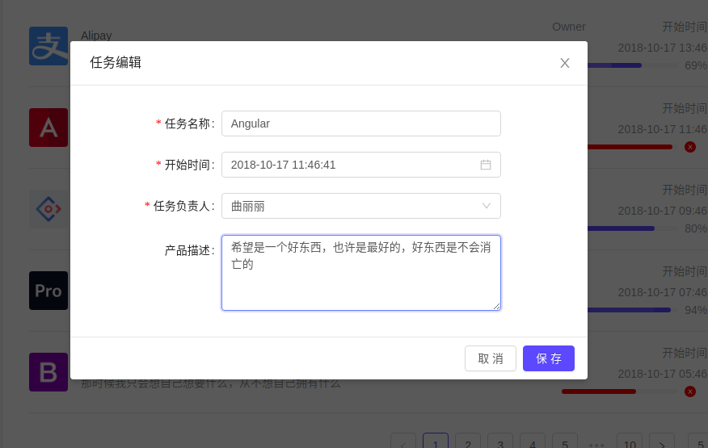
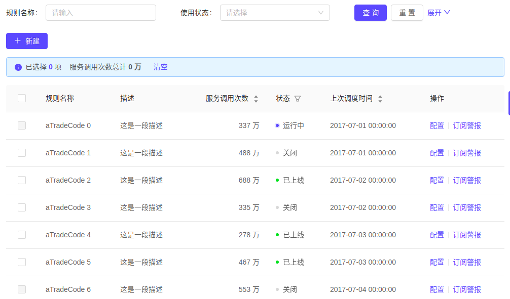

# 代码设计原则

 

> 目录

## 总体设计

一个功能包含：`列表页`　`编辑页`  `详细页`

为什么需要详情页呢？　因为有些功能是有权限设计的，通过详情页，可以进行权限控制

建议使用`输入项较多`这种模式

### 输入项较少

如果输入的项目小于７个，同时没有更复杂的详细，建议通过填出对话框，进行编辑．

这样做的好处是，在一个页面中就可以操作．

### 输入项较多

页面跳转的流程

`列表页` -> `详细页`  -> `编辑页`　-> `编辑成功后，弹[编辑成功对话框]`

[编辑成功对话框]: 上面有　返回列表　重新编辑　两个按钮

## 推荐页面设计

### 列表面

这个页面具备一下内容：

* 新增
* 删除
* 编辑
* 检索

###  详细面

在这个页面可以添加相关的操作

### 编辑页

当输入项目少时候，用简单编辑页面．如果输入内容多，可以使用高级页面

