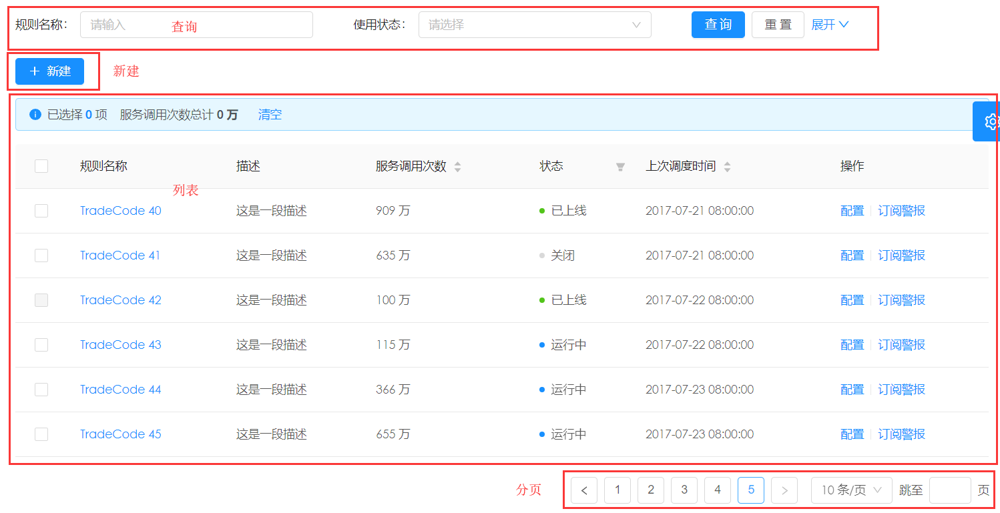
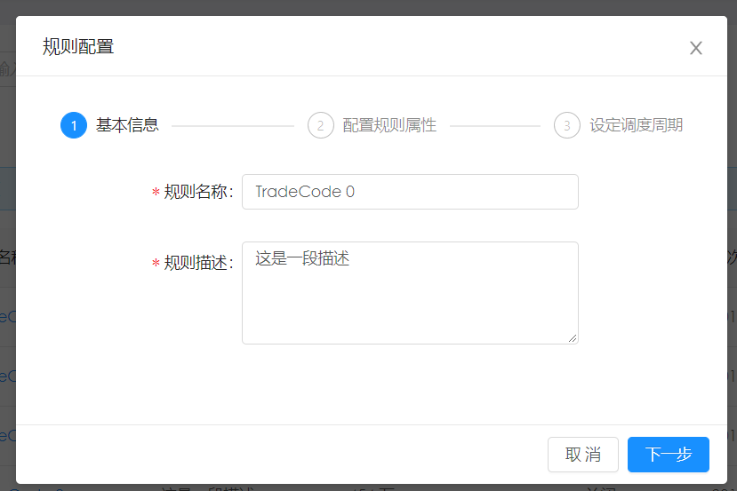
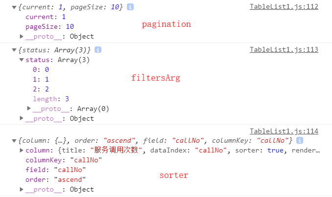
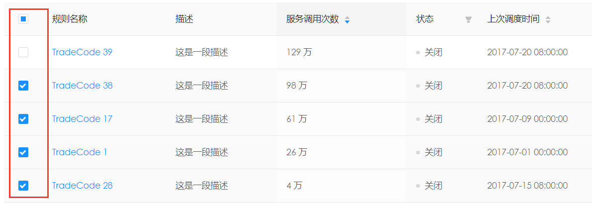

# 完整的CURD例子


## 功能设计

基本UI设计







## 实现步骤

* 实现检索功能
  * 实现基本列表与分分页功能
  * 实现列表表头排序
  * 实现用户按照条件检索
* 编辑功能
  * 追加
  * 配置
  * 批量操作
* 详情


## 实现检索功能


### 服务器端功能


> mock:rule.js

```jsx
function getRule(req, res, u) {
  let url = u;
  if (!url || Object.prototype.toString.call(url) !== '[object String]') {
    url = req.url; // eslint-disable-line
  }

  const params = parse(url, true).query;

  let dataSource = tableListDataSource;
    ....................................................
    
  let pageSize = 10;
  if (params.pageSize) {
    pageSize = params.pageSize * 1;
  }

  const result = {
    list: dataSource,
    pagination: {
      total: dataSource.length,
      pageSize,
      current: parseInt(params.currentPage, 10) || 1,
    },
  };

  return res.json(result);
}
```


其中通过参数u得到相关url参数

```jsx
let url = u;
if (!url || Object.protot
  url = req.url; // eslin
}
const params = parse(url,
console.log(u)
console.log(url)
console.log(params)
```

在console中得到相应的数值

```
[Function: next]
/api/rule?
[Object: null prototype] {}
----------下面是带的参数
[Function: next]
/api/rule?currentPage=1&pageSize=10&name=a&status=&sorter=callNo_ascend
[Object: null prototype] {
  currentPage: '1',
  pageSize: '10',
  name: 'a',
  status: '',
  sorter: 'callNo_ascend' }
```


>  service

```jsx
export async function queryRule(params) {
  return request(`/api/rule?${stringify(params)}`);
}

export async function removeRule(params) {
  return request('/api/rule', {
    method: 'POST',
    data: {
      ...params,
      method: 'delete',
    },
  });
}

export async function addRule(params) {
  return request('/api/rule', {
    method: 'POST',
    data: {
      ...params,
      method: 'post',
    },
  });
}

export async function updateRule(params = {}) {
  return request(`/api/rule?${stringify(params.query)}`, {
    method: 'POST',
    data: {
      ...params.body,
      method: 'update',
    },
  });
}
```


### 显示表格

#### 使用的Table控件

```jsx

render() {
  console.log(this.props);
  const{fanhlRule:{data},}=this.props;
  return(
    <div>
      <Card bordered={false}>
        <Table dataSource={data.list} columns={this.columns} />
      </Card>
    </div>
  )
}

```

#### 定义表头

> columns属性

* render 生成复杂数据的渲染函数
  * 参数 Function(text, record, index) {}
* sorter: 排序函数，本地排序使用一个函数(参考 Array.sort 的 compareFunction)，需要服务端排序可设为 true
* needTotal:自己定义的属性
* filters：表头的筛选菜单项


> 使用过的控件

* Badge：[徽标](https://ant.design/components/badge-cn/)
* Fragment：React 中一个常见模式是为一个组件返回多个元素。Fragments 可以让你聚合一个子元素列表，并且不在DOM中增加额外节点。
* Divider：[分割线](https://ant.design/components/divider-cn/)


````jsx
columns = [
  {
    title: '规则名称',
    dataIndex: 'name',
    render: text => <a onClick={() => this.previewItem(text)}>{text}</a>,
  },
  {
    title: '描述',
    dataIndex: 'desc',
  },
  {
    title: '服务调用次数',
    dataIndex: 'callNo',
    sorter: true,
    render: val => `${val} 万`,
    // mark to display a total number
    needTotal: true,
  },
  {
    title: '状态',
    dataIndex: 'status',
    filters: [
      {
        text: status[0],
        value: 0,
      },
      {
        text: status[1],
        value: 1,
      },
      {
        text: status[2],
        value: 2,
      },
      {
        text: status[3],
        value: 3,
      },
    ],
    render(val) {
      return <Badge status={statusMap[val]} text={status[val]} />;
    },
  },
  {
    title: '上次调度时间',
    dataIndex: 'updatedAt',
    sorter: true,
    render: val => <span>{moment(val).format('YYYY-MM-DD HH:mm:ss')}</span>,
  },
  {
    title: '操作',
    render: (text, record) => (
      <Fragment>
        <a onClick={() => this.handleUpdateModalVisible(true, record)}>配置</a>
        <Divider type="vertical" />
        <a href="">订阅警报</a>
      </Fragment>
    ),
  },
];
````


### 排序与筛选功能

使用到了Table的onChange功能

* 分页、排序、筛选变化时触发
  * Function(pagination, filters, sorter, extra: { currentDataSource: [] })


```jsx
handleStandardTableChange = (pagination, filtersArg, sorter) => {
  const { dispatch } = this.props;
  const filters = Object.keys(filtersArg).reduce((obj, key) => {
    const newObj = { ...obj };
    newObj[key] = getValue(filtersArg[key]);
    return newObj;
  }, {});
  const params = {
    currentPage: pagination.current,
    pageSize: pagination.pageSize,
    ...filters,
  };
  if (sorter.field) {
    params.sorter = `${sorter.field}_${sorter.order}`;
  }
  dispatch({
    type: 'fanhlRule/fetch',
    payload: params,
  });
};
<Table dataSource={data.list} columns={this.columns} onChange={this.handleStandardTableChange} />

```

> 参数的例子：pagination, filtersArg, sorter

转换成下面的形式，传递给后台。

```
/api/rule?currentPage=1&pageSize=10&status=0%2C1%2C2&sorter=callNo_ascend
[Object: null prototype] {
  currentPage: '1',
  pageSize: '10',
  status: '0,1,2',
  sorter: 'callNo_ascend' }
```





其中filterArg自动转换成：status: "2,1,0"


### 按条件进行检索

由于检索条件是form所以要添加 @Form.create()

#### 功能设计

简要检索与详细检索两个。 主要的功能

* 查询按钮
* 重置按钮
* 展开按钮


#### state设计

在这个功能中，有两个中间变量，一个是展开状态，一个是用户输入的内容。

```jsx
state = {
  expandForm: false,
  formValues: {},
};
```

#### 显示页面

根据state的属性，判断到底显示那个页面，由于使用了form，在同一个名字下的控件，可以保留数据。

```jsx
renderForm() {
  const { expandForm } = this.state;
  return expandForm ? this.renderAdvancedForm() : this.renderSimpleForm();
}

renderSimpleForm() {
  const {
    form: { getFieldDecorator },
  } = this.props;
  return (
    <Form onSubmit={this.handleSearch} layout="inline">
      <Row gutter={{ md: 8, lg: 24, xl: 48 }}>
        <Col md={8} sm={24}>
          <FormItem label="规则名称">
            {getFieldDecorator('name')(<Input placeholder="请输入" />)}
          </FormItem>
        </Col>
        <Col md={8} sm={24}>
          <FormItem label="使用状态">
            {getFieldDecorator('status')(
              <Select placeholder="请选择" style={{ width: '100%' }}>
                <Option value="0">关闭</Option>
                <Option value="1">运行中</Option>
              </Select>
            )}
          </FormItem>
        </Col>
        <Col md={8} sm={24}>
          <span className={styles.submitButtons}>
            <Button type="primary" htmlType="submit">
              查询
            </Button>
            <Button style={{ marginLeft: 8 }} onClick={this.handleFor
              重置
            </Button>
            <a style={{ marginLeft: 8 }} onClick={this.toggleForm}>
              展开 <Icon type="down" />
            </a>
          </span>
        </Col>
      </Row>
    </Form>
  );
}
```


#### 开发函数

#####  查询函数handleSearch

````jsx
handleSearch = e => {
  e.preventDefault();
  const { dispatch, form } = this.props;
  form.validateFields((err, fieldsValue) => {
    if (err) return;
    console.log(fieldsValue)
    const values = {
      ...fieldsValue,
      updatedAt: fieldsValue.updatedAt && fieldsValue.updatedAt.valueOf(),
    };
    this.setState({
      formValues: values,
    });
    console.log(values)
    dispatch({
      type: 'fanhlRule/fetch',
      payload: values,
    });
  });
};
````

##### 重置函数 handleFormReset

```jsx
handleFormReset = () => {
  const { form, dispatch } = this.prop
  form.resetFields();
  this.setState({
    formValues: {},
  });
  dispatch({
    type: 'fanhlRule/fetch',
    payload: {},
  });
};
```

##### 展开函数

```jsx
toggleForm = () => {
  const { expandForm } = this.state;
  this.setState({
    expandForm: !expandForm,
  });
};
```


### 排序与检索做关联

这时候会发现，如果排序的时候，原先的检索结果不对了。

在state中保存了`formValues`，所以在table的handleStandardTableChange中，就可以得到检索数据了

```jsx
handleStandardTableChange = (pagination, filtersArg, sorter) => {
  const { dispatch } = this.props;
  const { formValues } = this.state; // 追加的代码
  const filters = Object.keys(filtersArg).reduce((obj, key) => {
    const newObj = { ...obj };
    newObj[key] = getValue(filtersArg[key]);
    return newObj;
  }, {});
  const params = {
    currentPage: pagination.current,
    pageSize: pagination.pageSize,
    ...formValues,  // 追加的代码
    ...filters,
  };
  if (sorter.field) {
    params.sorter = `${sorter.field}_${sorter.order}`;
  }
  dispatch({
    type: 'fanhlRule/fetch',
    payload: params,
  });
};
```


### 添加选择功能





#### 功能描述

* 有记忆功能，分页还可以记录。
* 某些记录的row，可以不能选择。
* 有汇总信息


#### 初步代码

> 在Table中添加`rowSelection={rowSelection}`

```jsx
<Table
  dataSource={data.list}
  rowSelection={rowSelection}
  columns={this.columns}
  onChange={this.handleStandardTableChange}
/>
```

> 添加`rowSelection`函数

```jsx
const rowSelection = {
  onChange: (selectedRowKeys, selectedRows) => {
    console.log(`selectedRowKeys: ${selectedRowKeys}`, 'selectedRows: ', selectedRows);
  },
  getCheckboxProps: record => ({
    disabled: record.name === 'Disabled User', // Column configuration not to be checked
    name: record.name,
  }),
};
```


### 指定每页的页数


