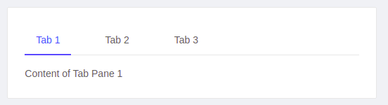
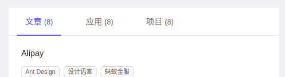
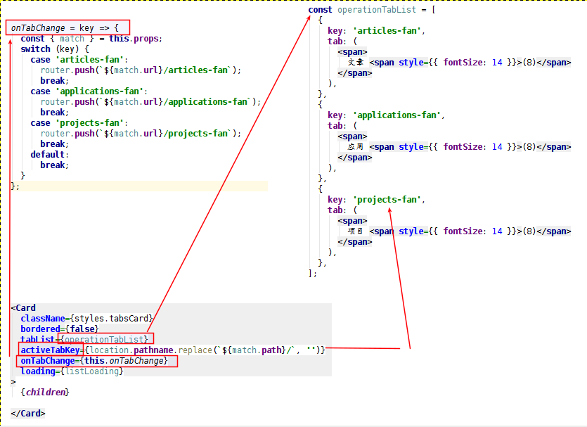
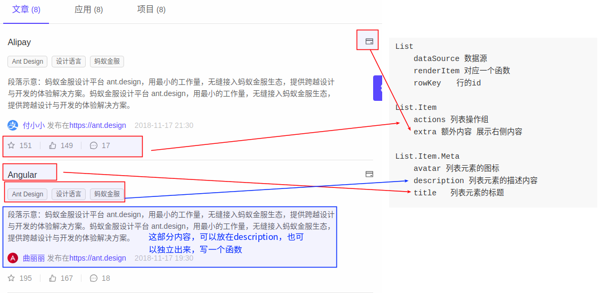
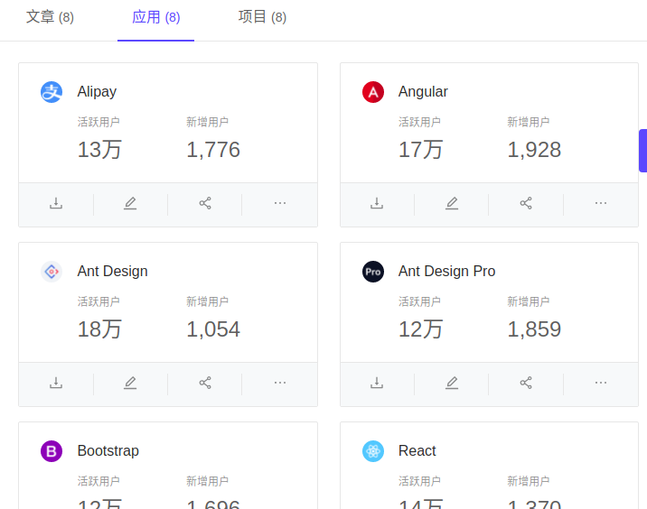
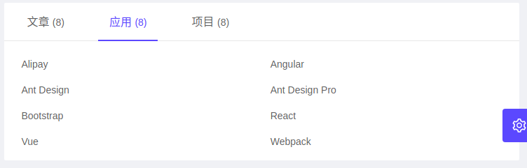

# ant design pro 例子 - 个人页


## 个人中心


```
数据分别从一下三个地方获取
１：user/fetchCurrent
２：list/fetch
３：project/fetchNotice
```


### 用到的标签

```
１：Card, 区块控件
２：Row, 行控件
３：Col, 列控件
４：Icon, 图标控件
５：Avatar, 头像控件
６：Tag, 标记控件
７：Divider, 分割线
８：Spin, 加载中
９：Input　输入框控件
```

* [Spin加载中](https://ant.design/components/spin-cn/)
* [Row与Col布局](https://ant.design/components/grid-cn/)


### Tag的动态处理

```
当点击＋时，显示输入框．
当输入输入完毕，或者回车后，就追加一个编辑框
需要三个变量：
１：需要一个状态，来判断是否实现．
２：临时保存输入框的数值
３：保存一个数组
需要三个函数：
１：点击＋的函数
２：焦点离开函数
３：回车函数
```

> 三个状态值

```js
  state = {
    newTags: [],
    inputVisible: false,
    inputValue: '',
  };
```

> 三个函数

```js
  showInput = () => {
    this.setState({ inputVisible: true }, () => this.input.focus());
  };

  saveInputRef = input => {
    this.input = input;
  };

  handleInputChange = e => {
    this.setState({ inputValue: e.target.value });
  };

  handleInputConfirm = () => {
    const { state } = this;
    const { inputValue } = state;
    let { newTags } = state;
    if (inputValue && newTags.filter(tag => tag.label === inputValue).length === 0) {
      newTags = [...newTags, { key: `new-${newTags.length}`, label: inputValue }];
    }
    this.setState({
      newTags,
      inputVisible: false,
      inputValue: '',
    });
  };
```

`es6语法`

```js
// 如果inputValue有数值，并且在newTags中找出与inputValue数值相等的字符串没有，就新加一个字符串到数组中．

if (inputValue && newTags.filter(tag => tag.label === inputValue).length === 0) {
      newTags = [...newTags, { key: `new-${newTags.length}`, label: inputValue }];
}
```

```js
// tags包含newTags后，循环遍历数组中的数据，得到item，并生成Tag数据  

{currentUser.tags.concat(newTags).map(item => (
    <Tag key={item.key}>{item.label}</Tag>
  ))}
```


> 页面上如何控制显示

```js
<div className={styles.tags}>
  <div className={styles.tagsTitle}>标签</div>
  {currentUser.tags.concat(newTags).map(item => (
    <Tag key={item.key}>{item.label}</Tag>
  ))}

  {inputVisible && (
    <Input
      ref={this.saveInputRef}　// 关联函数
      type="text"
      size="small"
      style={{ width: 78 }}
      value={inputValue}
      onChange={this.handleInputChange}　//捕获输入函数
      onBlur={this.handleInputConfirm}　//确认函数
      onPressEnter={this.handleInputConfirm}　//确认函数
    />
  )}

  {!inputVisible && (
    <Tag
      onClick={this.showInput}　//显示输入框函数
      style={{ background: '#fff', borderStyle: 'dashed' }}
    >
      <Icon type="plus" />
    </Tag>
  )}


</div>
```


​	

### Tab标签的两种处理方法


#### 普通做法

```js

import { Tabs } from 'antd';
const TabPane = Tabs.TabPane;
<Tabs defaultActiveKey="1" >
  <TabPane tab="Tab 1" key="1">Content of Tab Pane 1</TabPane>
  <TabPane tab="Tab 2" key="2">Content of Tab Pane 2</TabPane>
  <TabPane tab="Tab 3" key="3">Content of Tab Pane 3</TabPane>
</Tabs>
```

这样做的好处是，所有的代码都在一个page页面中．





#### 使用Card的Tab

* 这样的做法可以把页面拆分到不同的页面中
* [Card标签说明](https://ant.design/components/card-cn/)




```
使用Card　Tab的步骤：
１：定义一个数据，用来存储Tab的Key与标题，key比较重要，因为ActiveTabKey会显示绿色的下划线
２：定义Card控件，tabList　activeTabKey　onTabChange
３：定义onTabChange函数，判断key，然后跳转到对应的页面
```





### 文章List列表

* [List列表的官方说明](https://ant.design/components/list-cn/)

```
List
	dataSource 数据源
	renderItem 对应一个函数,在这个函数中，指定List.Item与List.Item.Meta
	rowKey　　行的id
	grid	列表栅格配置

List.Item
	actions 列表操作组
	extra 额外内容 展示右侧内容

List.Item.Meta
	avatar 列表元素的图标
	description 列表元素的描述内容
	title 	列表元素的标题

```




### 应用List列表

```
在这个页面中，使用了List控件
为了显示列表，使用了List中的grid珊格控件
具体的显示，用了Card控件
```




#### 没有用Card的实现

```js
  render() {
    const {
      list: { list },
    } = this.props;

    return (
     <List
       rowKey="id"
       className={stylesApplications.filterCardList}
       grid={{ gutter: 24, xxl: 3, xl: 2, lg: 2, md: 2, sm: 2, xs: 1 }}
       dataSource={list}
       renderItem={item =>(
         <List.Item key={item.id}>
           {item.title}
         </List.Item>

       )}
     />
    )
  }
```




#### 使用Card后的页面

```
在Card的工具条部分使用了下列控件：
１：Tooltip　　文字提示控件
２：Icon 图标控件
３：Dropdown　下来框控件＋Menu菜单控件

```

* [card控件]()

```
Card控件的使用
Card
	actions	卡片操作组，位置在卡片底部
	hoverable	鼠标移过时可浮起
Card.Meta
	avatar	头像/图标
	title	标题内容
	description	描述内容(这个例子中没有用，而是单独用了一个div标签给表示出来了)

```


