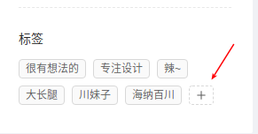
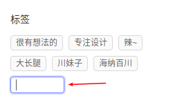

# ant design pro 例子 - 个人页


## 个人中心


```
数据分别从一下三个地方获取
１：user/fetchCurrent
２：list/fetch
３：project/fetchNotice
```


### Tab的动态处理

```
当点击＋时，显示输入框．
当输入输入完毕，或者回车后，就追加一个编辑框
需要三个变量：
１：需要一个状态，来判断是否实现．
２：临时保存输入框的数值
３：保存一个数组
需要三个函数：
１：点击＋的函数
２：焦点离开函数
３：回车函数
```

> 三个状态值

```js
  state = {
    newTags: [],
    inputVisible: false,
    inputValue: '',
  };
```

> 三个函数

```js
  showInput = () => {
    this.setState({ inputVisible: true }, () => this.input.focus());
  };

  saveInputRef = input => {
    this.input = input;
  };

  handleInputChange = e => {
    this.setState({ inputValue: e.target.value });
  };

  handleInputConfirm = () => {
    const { state } = this;
    const { inputValue } = state;
    let { newTags } = state;
    if (inputValue && newTags.filter(tag => tag.label === inputValue).length === 0) {
      newTags = [...newTags, { key: `new-${newTags.length}`, label: inputValue }];
    }
    this.setState({
      newTags,
      inputVisible: false,
      inputValue: '',
    });
  };
```

`es6语法`

```js
// 如果inputValue有数值，并且在newTags中找出与inputValue数值相等的字符串没有，就新加一个字符串到数组中．

if (inputValue && newTags.filter(tag => tag.label === inputValue).length === 0) {
      newTags = [...newTags, { key: `new-${newTags.length}`, label: inputValue }];
}
```

```js
// tags包含newTags后，循环遍历数组中的数据，得到item，并生成Tag数据  

{currentUser.tags.concat(newTags).map(item => (
    <Tag key={item.key}>{item.label}</Tag>
  ))}
```


> 页面上如何控制显示

```js
<div className={styles.tags}>
  <div className={styles.tagsTitle}>标签</div>
  {currentUser.tags.concat(newTags).map(item => (
    <Tag key={item.key}>{item.label}</Tag>
  ))}

  {inputVisible && (
    <Input
      ref={this.saveInputRef}　// 关联函数
      type="text"
      size="small"
      style={{ width: 78 }}
      value={inputValue}
      onChange={this.handleInputChange}　//捕获输入函数
      onBlur={this.handleInputConfirm}　//确认函数
      onPressEnter={this.handleInputConfirm}　//确认函数
    />
  )}

  {!inputVisible && (
    <Tag
      onClick={this.showInput}　//显示输入框函数
      style={{ background: '#fff', borderStyle: 'dashed' }}
    >
      <Icon type="plus" />
    </Tag>
  )}


</div>
```








​	