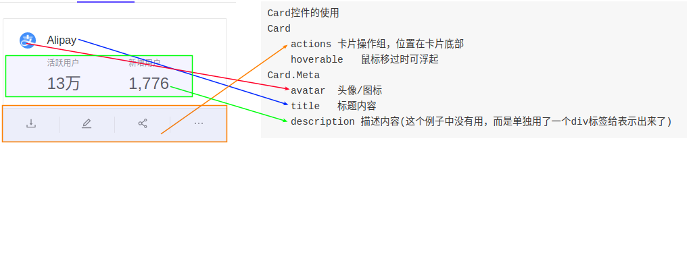
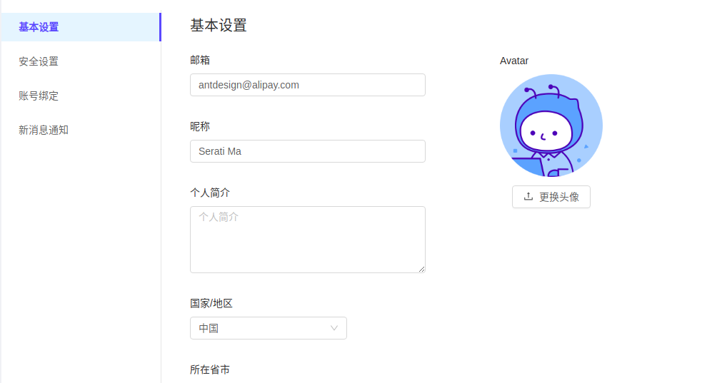

# ant design pro 例子 - 个人页

> 目录

* [个人中心](#个人中心)
  * [用到的标签](#用到的标签)
  * [Tag的动态处理](#Tag的动态处理)
  * [Tab标签的两种处理方法](#Tab标签的两种处理方法)
  * [文章List列表](#文章List列表)
  * [应用List列表](#应用List列表)
  * [项目List列表](#项目List列表)
* [个人设置](#个人设置)
  * [React自带的函数](#React自带的函数)
  * [State定义的内容](#State定义的内容)
  * [私有函数](#私有函数)
  * [页面展示](#页面展示)
  * [基本设置页面](#基本设置页面)
    * [Form的具体用法](#Form的具体用法)
    * [电话号码输入框](#电话号码输入框)
    * [省市下拉选择框](#省市下拉选择框)
  * [安全设置页面](#安全设置页面)
  * [账号绑定](#账号绑定)
  * [新消息通知](#新消息通知)


## 个人中心


```
数据分别从一下三个地方获取
１：user/fetchCurrent
２：list/fetch
３：project/fetchNotice
```


### 用到的标签

```
１：Card, 区块控件
２：Row, 行控件
３：Col, 列控件
４：Icon, 图标控件
５：Avatar, 头像控件
６：Tag, 标记控件
７：Divider, 分割线
８：Spin, 加载中
９：Input　输入框控件
```

* [Spin加载中](https://ant.design/components/spin-cn/)
* [Row与Col布局](https://ant.design/components/grid-cn/)


### Tag的动态处理

```
当点击＋时，显示输入框．
当输入输入完毕，或者回车后，就追加一个编辑框
需要三个变量：
１：需要一个状态，来判断是否实现．
２：临时保存输入框的数值
３：保存一个数组
需要三个函数：
１：点击＋的函数
２：焦点离开函数
３：回车函数
```

> 三个状态值

```js
  state = {
    newTags: [],
    inputVisible: false,
    inputValue: '',
  };
```

> 三个函数

```js
  showInput = () => {
    this.setState({ inputVisible: true }, () => this.input.focus());
  };

  saveInputRef = input => {
    this.input = input;
  };

  handleInputChange = e => {
    this.setState({ inputValue: e.target.value });
  };

  handleInputConfirm = () => {
    const { state } = this;
    const { inputValue } = state;
    let { newTags } = state;
    if (inputValue && newTags.filter(tag => tag.label === inputValue).length === 0) {
      newTags = [...newTags, { key: `new-${newTags.length}`, label: inputValue }];
    }
    this.setState({
      newTags,
      inputVisible: false,
      inputValue: '',
    });
  };
```

`es6语法`

```js
// 如果inputValue有数值，并且在newTags中找出与inputValue数值相等的字符串没有，就新加一个字符串到数组中．

if (inputValue && newTags.filter(tag => tag.label === inputValue).length === 0) {
      newTags = [...newTags, { key: `new-${newTags.length}`, label: inputValue }];
}
```

```js
// tags包含newTags后，循环遍历数组中的数据，得到item，并生成Tag数据  

{currentUser.tags.concat(newTags).map(item => (
    <Tag key={item.key}>{item.label}</Tag>
  ))}
```


> 页面上如何控制显示

```js
<div className={styles.tags}>
  <div className={styles.tagsTitle}>标签</div>
  {currentUser.tags.concat(newTags).map(item => (
    <Tag key={item.key}>{item.label}</Tag>
  ))}

  {inputVisible && (
    <Input
      ref={this.saveInputRef}　// 关联函数
      type="text"
      size="small"
      style={{ width: 78 }}
      value={inputValue}
      onChange={this.handleInputChange}　//捕获输入函数
      onBlur={this.handleInputConfirm}　//确认函数
      onPressEnter={this.handleInputConfirm}　//确认函数
    />
  )}

  {!inputVisible && (
    <Tag
      onClick={this.showInput}　//显示输入框函数
      style={{ background: '#fff', borderStyle: 'dashed' }}
    >
      <Icon type="plus" />
    </Tag>
  )}


</div>
```


​	

### Tab标签的两种处理方法


#### 普通做法

```js

import { Tabs } from 'antd';
const TabPane = Tabs.TabPane;
<Tabs defaultActiveKey="1" >
  <TabPane tab="Tab 1" key="1">Content of Tab Pane 1</TabPane>
  <TabPane tab="Tab 2" key="2">Content of Tab Pane 2</TabPane>
  <TabPane tab="Tab 3" key="3">Content of Tab Pane 3</TabPane>
</Tabs>
```

这样做的好处是，所有的代码都在一个page页面中．


#### 使用Card的Tab

* 这样的做法可以把页面拆分到不同的页面中
* [Card标签说明](https://ant.design/components/card-cn/)


```
使用Card　Tab的步骤：
１：定义一个数据，用来存储Tab的Key与标题，key比较重要，因为ActiveTabKey会显示绿色的下划线
２：定义Card控件，tabList　activeTabKey　onTabChange
３：定义onTabChange函数，判断key，然后跳转到对应的页面
```


### 文章List列表

* [List列表的官方说明](https://ant.design/components/list-cn/)

```
List
	dataSource 数据源
	renderItem 对应一个函数,在这个函数中，指定List.Item与List.Item.Meta
	rowKey　　行的id
	grid	列表栅格配置

List.Item
	actions 列表操作组
	extra 额外内容 展示右侧内容

List.Item.Meta
	avatar 列表元素的图标
	description 列表元素的描述内容
	title 	列表元素的标题

```


### 应用List列表

```
在这个页面中，使用了List控件
为了显示列表，使用了List中的grid珊格控件
具体的显示，用了Card控件
```


#### 没有用Card的实现

```js
  render() {
    const {
      list: { list },
    } = this.props;

    return (
     <List
       rowKey="id"
       className={stylesApplications.filterCardList}
       grid={{ gutter: 24, xxl: 3, xl: 2, lg: 2, md: 2, sm: 2, xs: 1 }}
       dataSource={list}
       renderItem={item =>(
         <List.Item key={item.id}>
           {item.title}
         </List.Item>

       )}
     />
    )
  }
```


#### 使用Card后的页面

```
在Card的工具条部分使用了下列控件：
１：Tooltip　　文字提示控件
２：Icon 图标控件
３：Dropdown　下来框控件＋Menu菜单控件

```

* [card控件]()

```
Card控件的使用
Card
	actions	卡片操作组，位置在卡片底部
	hoverable	鼠标移过时可浮起
Card.Meta
	avatar	头像/图标
	title	标题内容
	description	描述内容(这个例子中没有用，而是单独用了一个div标签给表示出来了)

```



### 项目List列表


```
在这个项目中用到的还是List控件
比前两个多了以下三部分：
１：封面　　cover={}
２：时间函数　import moment from 'moment';
３：AvatarList用户头像列表
	
其他的跟Application都一样

```


* [AvatarList官方说明](https://pro.ant.design/components/AvatarList-cn)


## 个人设置




### React自带的函数

```
下面是Class默认的一些函数
１：constructor
	这是ES6对类的默认方法，通过 new 命令生成对象实例时自动调用该方法。并且，该方法是类中必须有的，如果没有显示定义，则会默认添加空的constructor( )方法。

２：getDerivedStateFromProps
	无论是state改变还是props改变，都会执行这个函数
	
３：componentDidMount
	在第一次渲染后调用，只在客户端。之后组件已经生成了对应的DOM结构，可以通过this.getDOMNode()来进行访问。 如果你想和其他JavaScript框架一起使用，可以在这个方法中调用setTimeout, setInterval或者发送AJAX请求等操作(防止异步操作阻塞UI)。
	
４：componentWillUnmount
	在组件从 DOM 中移除之前立刻被调用
	
５：resize
	上面的３与４是用来监听窗口变化引起的事件，当窗口比较大的时候，菜单是在左边．
	如果窗口比较小的时候，菜单显示在上边


```


### State定义的内容

```
1:mode: 'inline', 菜单是在最左侧，还是顶部
2:menuMap,菜单定义
3:selectKey，当前选中的菜单数值

menuMap定义
{
    "base-fan":基本设置
    "security-fan": 安全设置
    "binding-fan":账号绑定
    "notification-fan":新消息通知
}
```


### 私有函数

```
１：getmenu　，得到Menu的Html列表
２：getRightTitle，得到右边的Title
３：selectKey，当点击菜单时，调用这个函数．
４：
```


### 页面展示

* [Menu组件的使用说明](http://09x.ant.design/components/menu/)

```
Menu
	mode 	菜单类型
	selectedKeys 	当前选中的菜单项 key 数组
	onClick 	点击 menuitem 调用此函数，参数为 {item, key}
	
Menu.Item props：菜单项目
	disabled 	是否禁用
	key 	item 的唯一标志
	
Menu.SubMenu props:如果有子菜单的化，这个父菜单
	title 	子菜单项值
	children 	(MenuItem or SubMenu)[] 	子菜单的菜单项
	

```

### 基本设置页面

```
使用的控件：
１：Form, Form.Item
２：Input, 
３：Upload, 
４：Select, Option
５：Button

```


#### Form的具体用法

* [官方说明](https://ant.design/components/form-cn/)

```
Form
	1:经 Form.create() 包装过的组件会自带 this.props.form 属性
	2:layout	表单布局
	3:onSubmit	数据验证成功后回调事件
	4:hideRequiredMark 隐藏所有表单项的必选标记
	
Form.create(options)
	1:@Form.create()
	2:getFieldDecorator	用于和表单进行双向绑定，详见下方描述
	3:form.setFieldsValue(obj);　用来给form添加数据
	4:
	
getFieldDecorator(id, options) 参数
	1:id	必填输入控件唯一标志。支持嵌套式的写法。
	2:options.rules	校验规则，参考下方文档
```


#### 电话号码输入框

> 功能说明

```
电话号码这个功能做的非常有特性，体现了react的封装．
１：数据库中有一个phone字段，传入到phone控件中，变成连个input输入框
２：在phone控件中传入两个变量：value, onChange
３：将value分解成一个数组，onChange事件中，将两个分开的数字拼写成一个电话号码010-62262345

```

> state与props的区别

```
props是一个从外部传进组件的参数，由于React具有单向数据流，所以它的主要作用是从父组件向子组件传递数据，它是不可改变的。如果想要改变它，只能通过外部组件传入新的props来重新渲染子组件，否则子组件的props以及展现形式不会改变。props除了可以传字符串、数字，还可以传数组，对象、甚至是回调函数。

state的主要作用是用于组件保存、控制以及修改自己的状态，它只能在constructor中初始化，state是可以被改变的。state放改动的一些属性，比如点击选中，再点击取消。类似的这种属性就可以放到state里。

没有state的叫做无状态组件，多用props少用state，多写无状态组件。
```

在看到这部分代码时，总在想怎么将数值给传到外面去


#### 省市下拉选择框

> 功能说明

```
省市两个下拉框选择
１：从数据库中查询省的列表
	从model中调用，分三步A:设置loading=true;B:从service中获取数据;C:将loading=false;

２：	


```


> 函数说明

```
重载的函数
１：componentDidMount　[这个函数一般用来查询数据]
组件渲染完成，已经出现在dom文档里，可以在各个周期实现特定的操作。

２：componentDidUpdate　［这个函数一般用在控件改变了］
在组件的更新已经同步到 DOM 中之后立刻被调用。该方法不会在初始化渲染的时候调用。使用该方法可以在组件更新之后操作 DOM 元素。


自己定义的函数
１：getProvinceOption　得到省的Option Html代码
２：getCityOption　得到市的Option Html代码
３：getOption　这个函数，被上面两个函数调用，用来具体生成html代码
４：selectProvinceItem，当省下拉框改变时，触发这个函数
	4.1:首先调用查询语句'geographic/fetchCity'，查询市
	4.2:其次设置province为当前选项，设置city为空．
５：selectCityItem，当市下拉框改变时，触发这个函数
６：conversionObject　初始化province, city
```

* [重载函数的说明](https://blog.csdn.net/qq_32014215/article/details/67636798)
* [select控件说明](https://ant.design/components/select-cn/)

```
Select控件
	１：value	指定当前选中的条目
	２：labelInValue　是否把每个选项的 label 包装到 value 中，会把 Select 的 value 类型从 string 变为 {key: string, label: ReactNode} 的格式
	３：showSearch　使单选模式可搜索
	４：onSelect　被选中时调用，参数为选中项的 value (或 key) 值
```


### 安全设置页面

```
这个页面中，定义了一个关于密码强度的变量
```


### 账号绑定

```
使用了List的　actions avatar title description 
```


### 新消息通知

```
这个页面使用了List控件用来展示信息
List控件有下列属性：dataSource renderItem List.Item-cations List.Item.Meta-title description
```


