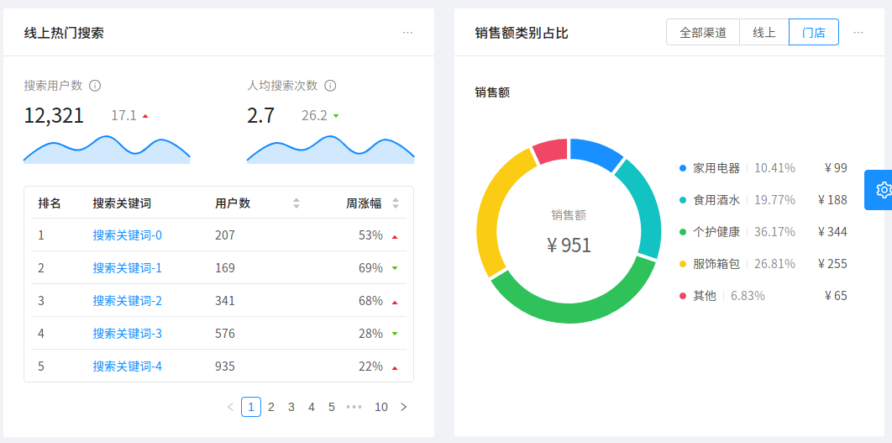
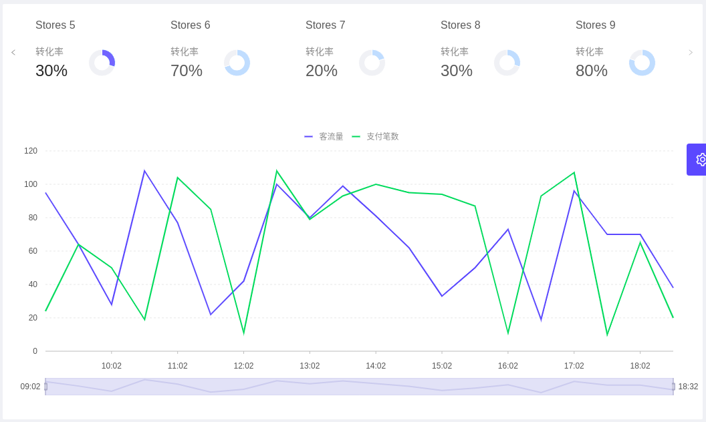
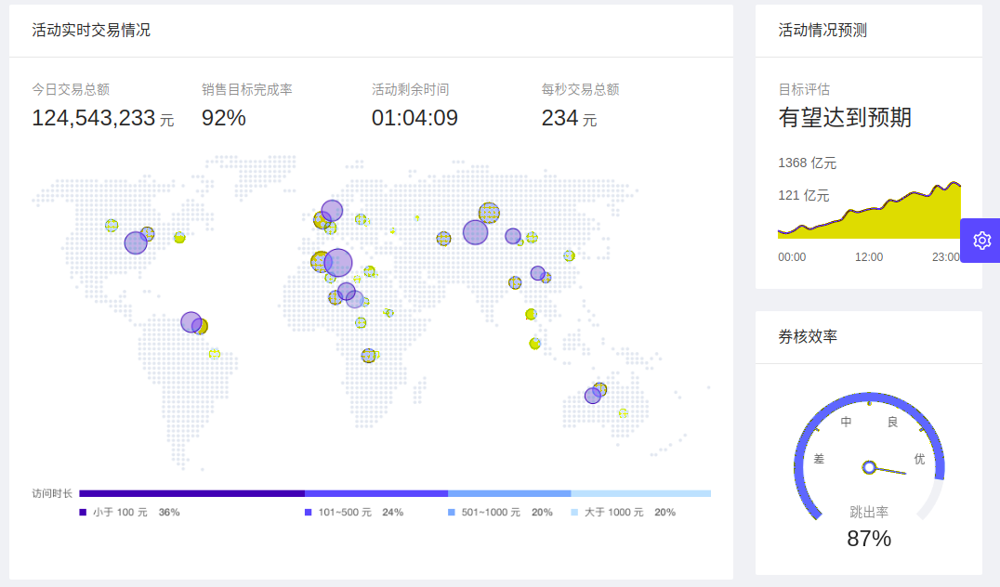
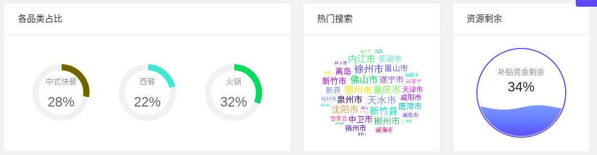

# ant design pro 例子 - DashBoard

> 目录

* [分析页](#分析页)


## 分析页


> 用到的组件

```
用到的antd组件
１：Row,Col,
２：Icon,
３：Card,
４：Tabs,
５：Table,
６：Radio,
７：DatePicker,
８：Tooltip,
９：Menu,
１０：Dropdown,

用到的Charts组件
１：ChartCard,
２：MiniArea,
３：MiniBar,
３：MiniProgress,
４：Field,
５：Bar,
６：Pie,
７：TimelineChart,

用到其他的组件
１：Trend　趋势标记　标记上升和下降趋势。通常用绿色代表“好”，红色代表“不好”，股票涨跌场景除外。
２：NumberInfo
３：numeral
４：GridContent
５：Yuan
６：getTimeDistance
```


```
１：使用了Row与Col删格操作．
２：每个小块，都使用了ChartCard
３：在ChartCard中，设置了title action total footer contentHeight
４：４个块中分别使用了　Trend趋势箭头　MiniArea区域图　　MiniBar柱状图　　MiniProgress进度图
```


```
１：最外层是tabs标签，并且使用了标签的扩展属性，所以在右侧有日期选择框．
２：中间部分做了左右两个删格处理，左侧是表格，右侧是列表
３：表格使用了Bar表格控件
４：列表使用了ul li span,其中span可以显示提示信息．
```




```
布局：
	１：一个Row，两Col，自动适应．
	２：热门搜索，使用了Card布局，右侧是一个extra=Dropdown+Menu的控件
		2.1:热搜使用了NumberInfo控件＋MiniArea控件，实现了图标
		2.2:下面的数据使用了Table控件
			2.2.1:首先定义columns:title,dataIndex,key,render,sorter,align
			2.2.2:指定dataSource
			2.2.3:指定分页pagination
	３：销售类别占比，使用了Card布局，右侧是一个extra=Dropdown+Menu的控件＋Radio.Group　Radio.Button
		3.1:点击全部渠道　线上　门店　后会刷新页面
		3.2:state中有一个salesType变量，可选的数值有：all online
			3.2.1:根据salesType来选择不同的数据源salesTypeData　salesTypeDataOnline　salesTypeDataOffline
    	
```




```
１：使用了Card在最外层
２：使用了Tabs，用来作为顶部导航
３：在顶部复杂部分是使用了自定义控件CustomTab
４：在中间部分使用了TimelineChart控件
５：CustomTab控件分为左右两部分
	5.1:左侧是NumberInfo
	5.2:右侧是Pie
```


## 监控页



```

```




```

```


## 公共组件说明


### Charts图表

* [官方说明](https://pro.ant.design/components/Charts-cn/)

```
ChartCard
１：title	卡片标题
２：action	卡片操作
３：total	数据总量
４：footer	卡片底部
５：contentHeight	内容区域高度	
６：avatar	左侧图标


```


### Tabs标签

```
Tabs
１：tabBarExtraContent	tab bar 上额外的元素
２：tabBarStyle	tab bar 的样式对象

Tabs.TabPane
１：key	对应 activeKey
２：tab	选项卡头显示文字

```


> Tabs bar右侧的扩展项目说明

```
四个选项［今日　本周　本月　全年］与一个日期选择框
```


> Tabs标签－动态生成

下面定义了CustomTab控件用来显示出一个复杂的Tab头

```
{offlineData.map(shop => (
   <TabPane tab={<CustomTab data={shop} currentTabKey={activeKey} />} key={shop.name}>
		bbbb
   </TabPane>
))}
```


### TimelineChart控件

* [官方说明](https://pro.ant.design/components/Charts-cn/#TimelineChart)

```
TimelineChart
１：data　　　　数据　Array<x, y1, y2>
２：height	高度值　Object{y1: '客流量', y2: '支付笔数'}
３：titleMap	指标别名
```


### DatePicker-RangePicker日期区间选择

* [官方说明地址](https://ant.design/components/date-picker-cn/)


```
引用：
	const { RangePicker } = DatePicker;

RangePicker
	１：value	日期
	２：onChange	日期范围发生变化的回调
```


> 功能说明

```
有４个选项：今日　本周　本月　全年．　
如果选中了某个选项，那么背景颜色改变，并且改变日期选择框的数值．

１：state中设置：rangePickerValue: getTimeDistance('year')，默认当年日期
２：当点击［今日　本周　本月　全年］，调用selectDate函数，重新设置rangePickerValue
３：isActive，是判断当［今日　本周　本月　全年］被选中后，样式发生改变
４：当选择日期区域框时，调用handleRangePickerChange函数，并且重新初始化state中rangePickerValue

```

> 常用日期函数

```
getTimeDistance　日期函数
	//引用
	import { getTimeDistance } from '@/utils/utils';
	//得到年的开始日期与结束日期：today　week　month　year
	rangePickerValue: getTimeDistance('year')
	//判断日期是否相等
	rangePickerValue[0].isSame(value[0], 'day')
```


### NumberInfo数据文本

```
NumberInfo
１：subTitle	子标题
２：gap	设置数字和描述之间的间距（像素）
３：total	总量
４：status	增加状态
５：subTotal	子总量
```

* [官方网址](https://pro.ant.design/components/NumberInfo-cn/)

### Table表格

```
常用的几个属性：
	１：columns	表格列的配置描述，具体项见下表
	２：dataSource	数据数组
	３：rowKey	表格行 key 的取值，可以是字符串或一个函数
	４：size	正常或迷你类型，default or small
	５：pagination	分页器，参考配置项或 pagination，设为 false 时不展示和进行分页

```

* [官方说明](https://ant.design/components/table-cn/)
  * 在官方文档中，有一个［[远程加载数据](https://ant.design/components/table-cn/#components-table-demo-ajax)］的例子，要仔细看看

> Column设置

```
Column配置

常用属性
	１：title	列头显示文字
	２：dataIndex	列数据在数据项中对应的 key，支持 a.b.c、a[0].b.c[1] 的嵌套写法
	３：key	React 需要的 key，如果已经设置了唯一的 dataIndex，可以忽略这个属性
	４：render	生成复杂数据的渲染函数，参数分别为当前行的值，当前行数据，行索引，@return里面可以设置表格行/列合并　Function(text, record, index) {}
	
辅助配置
	１：align	设置列内容的对齐方式
	２：className	列的 className
	３：sorter	排序函数，本地排序使用一个函数(参考 Array.sort 的 compareFunction)，需要服务端排序可设为 true	Function|boolean
	
	
高级配置
	１：onChange	分页、排序、筛选变化时触发	Function(pagination, filters, sorter, extra: { currentDataSource: [] })	
	２：rowKey	表格行 key 的取值，可以是字符串或一个函数	string|Function(record):string	'key'
	３：pagination	分页器，参考配置项或 pagination，设为 false 时不展示和进行分页

```


按照 [React 的规范](https://facebook.github.io/react/docs/lists-and-keys.html#keys)，所有的组件数组必须绑定 key。在 Table 中，`dataSource` 和 `columns` 里的数据值都需要指定 `key` 值。对于 `dataSource` 默认将每列数据的 `key` 属性作为唯一的标识。

如果你的数据没有这个属性，务必使用 `rowKey` 来指定数据列的主键。若没有指定，控制台会出现以下的提示，表格组件也会出现各类奇怪的错误。


### Pagination分页

* [官方文档](https://ant.design/components/pagination-cn/)

### Radio单选框

```
RadioGroup
	１：value	用于设置当前选中的值
	２：onChange	选项变化时的回调函数
	
Radio.Button 
	１：value	根据 value 进行比较，判断是否选中
	
```

* [官方文档](https://ant.design/components/radio-cn/)


### Pie饼形图

```
Pie
	１：hasLegend	是否显示图例的说明 legend
	２：subTitle	图表子标题
	３：total	图标中央的总数
	４：data
	５：valueFormat	显示值的格式化函数
	６：height	图表高度，这个必须指定
	７：lineWidth　图中的每个区块间隔
```


* [官方网址](https://pro.ant.design/components/Charts-cn/#Pie)


### 技巧

#### 统一珊格设置

>topColResponsiveProps 是一个共用的代码

```js
    const topColResponsiveProps = {
      xs: 24,
      sm: 12,
      md: 12,
      lg: 12,
      xl: 6,
      style: { marginBottom: 24 },
    };

    return (
      <GridContent>
        <Row gutter={24}>
          <Col {...topColResponsiveProps}>
            ssssssaaa
          </Col>
        </Row>
      </GridContent>
    )

```


#### 人民币标记符号

```
 import Yuan from '@/utils/Yuan';
  <Yuan>126560</Yuan>
 
```


#### 数字格式化

格式化千分位

```
import numeral from 'numeral';
value={`￥${numeral(12423).format('0,0')}`}
```

使用了一个共用的组件：http://numeraljs.com/


#### 两目运算符

```
在指定样式的时候，非常有用：
theme={currentKey !== data.name && 'light'}
color={currentKey !== data.name && '#BDE4FF'} //当不等于时，就显示一个灰色的

console.log( 5 && 4 );//当结果为真时，返回第二个为真的值4 
console.log( 0 && 4 );//当结果为假时，返回第一个为假的值0 
console.log( 5 || 4 );//当结果为真时，返回第一个为真的值5 
console.log( 0 || 0 );//当结果为假时，返回第二个为假的值0 

```

