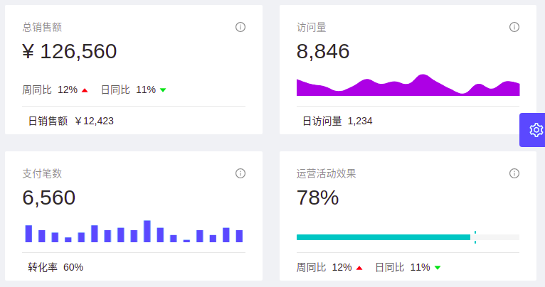
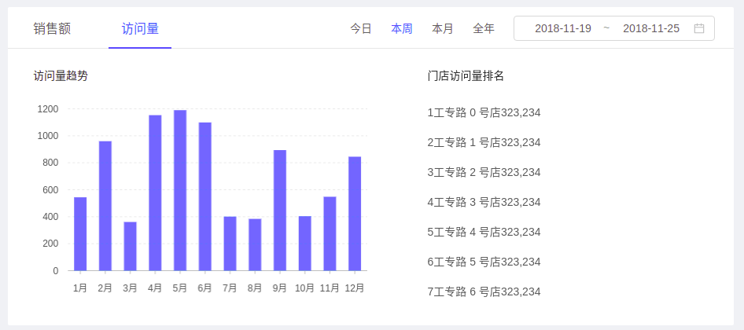

# ant design pro 例子 - DashBoard

> 目录

* [分析页](#分析页)


## 分析页


> 用到的组件

```
用到的antd组件
１：Row,Col,
２：Icon,
３：Card,
４：Tabs,
５：Table,
６：Radio,
７：DatePicker,
８：Tooltip,
９：Menu,
１０：Dropdown,

用到的Charts组件
１：ChartCard,
２：MiniArea,
３：MiniBar,
３：MiniProgress,
４：Field,
５：Bar,
６：Pie,
７：TimelineChart,

用到其他的组件
１：Trend　趋势标记　标记上升和下降趋势。通常用绿色代表“好”，红色代表“不好”，股票涨跌场景除外。
２：NumberInfo
３：numeral
４：GridContent
５：Yuan
６：getTimeDistance
```





```
１：使用了Row与Col删格操作．
２：每个小块，都使用了ChartCard
３：在ChartCard中，设置了title action total footer contentHeight
４：４个块中分别使用了　Trend趋势箭头　MiniArea区域图　　MiniBar柱状图　　MiniProgress进度图
```





```
１：最外层是tabs标签，并且使用了标签的扩展属性，所以在右侧有日期选择框．
２：中间部分做了左右两个删格处理，左侧是表格，右侧是列表
３：表格使用了Bar表格控件
４：列表使用了ul li span,其中span可以显示提示信息．
```


### Charts图表

* [官方说明](https://pro.ant.design/components/Charts-cn/)

```
ChartCard
１：title	卡片标题
２：action	卡片操作
３：total	数据总量
４：footer	卡片底部
５：contentHeight	内容区域高度	
６：avatar	左侧图标


```


### Tabs标签

```
Tabs
１：tabBarExtraContent	tab bar 上额外的元素
２：tabBarStyle	tab bar 的样式对象

Tabs.TabPane
１：key	对应 activeKey
２：tab	选项卡头显示文字

```


> Tabs bar右侧的扩展项目说明

```
四个选项［今日　本周　本月　全年］与一个日期选择框
```


### DatePicker-RangePicker日期区间选择

* [官方说明地址](https://ant.design/components/date-picker-cn/)


```
引用：
	const { RangePicker } = DatePicker;

RangePicker
	１：value	日期
	２：onChange	日期范围发生变化的回调
```


> 功能说明

```
有４个选项：今日　本周　本月　全年．　
如果选中了某个选项，那么背景颜色改变，并且改变日期选择框的数值．

１：state中设置：rangePickerValue: getTimeDistance('year')，默认当年日期
２：当点击［今日　本周　本月　全年］，调用selectDate函数，重新设置rangePickerValue
３：isActive，是判断当［今日　本周　本月　全年］被选中后，样式发生改变
４：当选择日期区域框时，调用handleRangePickerChange函数，并且重新初始化state中rangePickerValue

```

> 常用日期函数

```
getTimeDistance　日期函数
	//引用
	import { getTimeDistance } from '@/utils/utils';
	//得到年的开始日期与结束日期：today　week　month　year
	rangePickerValue: getTimeDistance('year')
	//判断日期是否相等
	rangePickerValue[0].isSame(value[0], 'day')
```


### 技巧

#### 统一珊格设置

>topColResponsiveProps 是一个共用的代码

```js
    const topColResponsiveProps = {
      xs: 24,
      sm: 12,
      md: 12,
      lg: 12,
      xl: 6,
      style: { marginBottom: 24 },
    };

    return (
      <GridContent>
        <Row gutter={24}>
          <Col {...topColResponsiveProps}>
            ssssssaaa
          </Col>
        </Row>
      </GridContent>
    )

```


#### 人民币标记符号

```
 import Yuan from '@/utils/Yuan';
  <Yuan>126560</Yuan>
 
```


#### 数字格式化

格式化千分位

```
import numeral from 'numeral';
value={`￥${numeral(12423).format('0,0')}`}
```

使用了一个共用的组件：http://numeraljs.com/

