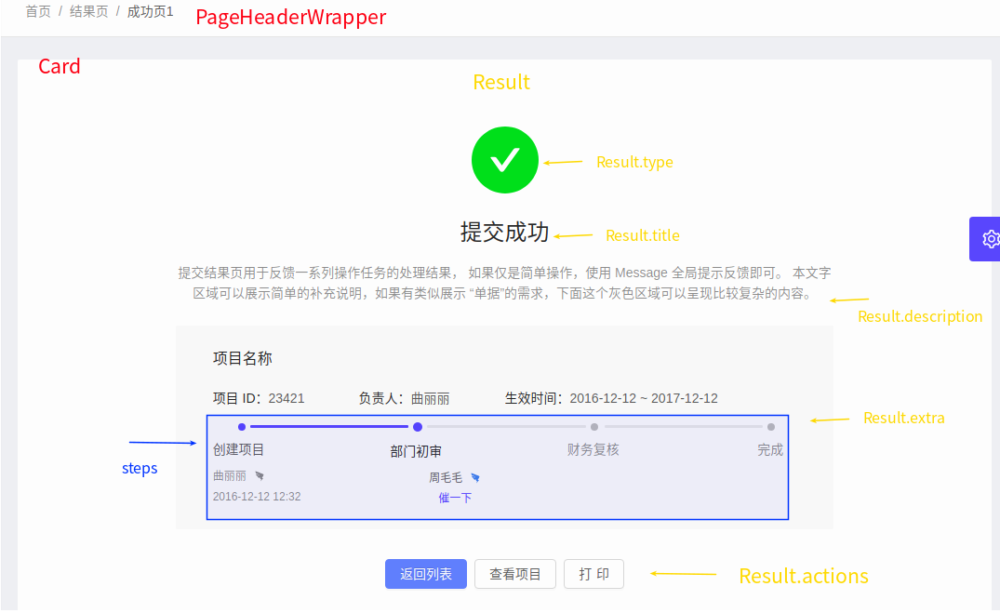
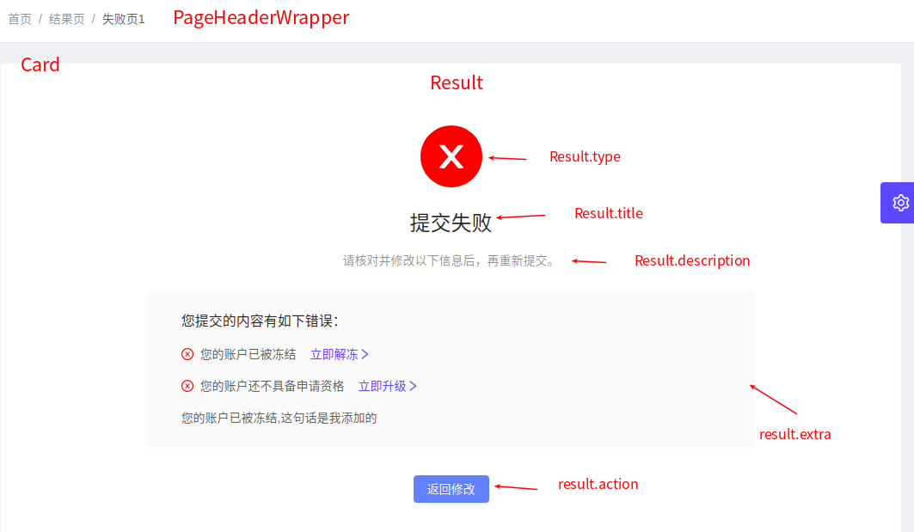

# ant design pro 例子 - 结果


* [result控件说明](https://pro.ant.design/components/Result-cn/)


## 成功页

```
使用的标准控件
１：Button　按钮
２：Row, Col,行列控件
３：Icon,　图标控件
４：Steps, 进度条控件
５：Card　卡片控件

使用的pro控件
１：Result　　结果页控件
２：PageHeaderWrapper　导航条控件

使用了多语言
import { formatMessage, FormattedMessage } from 'umi/locale';
formatMessage 是函数　　FormattedMessage　是标签
例如：title={formatMessage({ id: 'app.result.success.title' })}
例如：<FormattedMessage id="app.result.success.step1-operator" defaultMessage="Qu Lili" />

```





## 错误页


```
使用的标准控件
1：Button　按钮
2：Icon,　图标控件
3：Steps, 进度条控件
4：Card　卡片控件

使用的pro控件
1：Result　　结果页控件
2：PageHeaderWrapper　导航条控件


```


