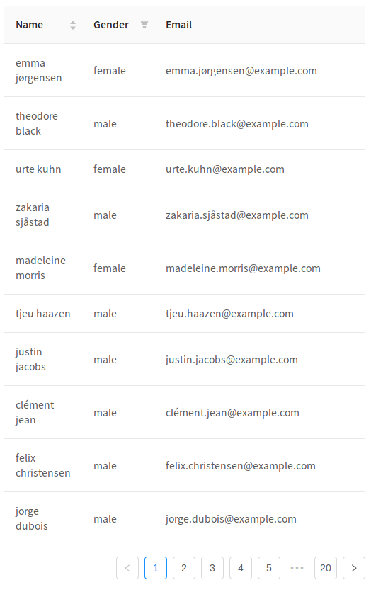

# ant design pro 例子 - Table远程加载


> 目录

* [相关网址](https://ant.design/components/table-cn/)
* [总体说明](#总体说明)
* [效果图](#效果图)
* [设计思路](#设计思路)
* [代码](#代码)


## 总体说明

这个例子通过简单的 ajax 读取方式，演示了如何从服务端读取并展现数据，具有筛选、排序等功能以及页面 loading 效果。开发者可以自行接入其他数据处理方式。

另外，本例也展示了筛选排序功能如何交给服务端实现，列不需要指定具体的 `onFilter` 和 `sorter` 函数，而是在把筛选和排序的参数发到服务端来处理。

**注意，此示例使用 模拟接口，展示数据可能不准确，请打开网络面板查看请求。**


## 效果图




## 设计思路

```
１：设定state
  state = {
    data: [],
    pagination: {},
    loading: false,
  };
 
 ２：页面一展示，就刷新数据
   componentDidMount() {
    this.fetch();
  }
  
 ３：刷新数据fetch()函数
 	3.1:设置state中的loading状态
 	3.2:将para参数传入到URL接口中，进行request查询
 	3.3:设置state中的loading　data pagination状态
 
 ４：制定onChange={this.handleTableChange}对应的事件
 　　4.1:handleTableChange = (pagination, filters, sorter) => {
 　　4.2:获得最新的页码，获得最新的排序与过滤数据．
 　　4.3:调用fetch()函数
 　　4.4:如果做的更精细一点，当条件都一样的时候，就不刷新服务器
  
```


## 代码

```js
import { Table } from 'antd';
import reqwest from 'reqwest';

const columns = [{
  title: 'Name',
  dataIndex: 'name',
  sorter: true,
  render: name => `${name.first} ${name.last}`,
  width: '20%',
}, {
  title: 'Gender',
  dataIndex: 'gender',
  filters: [
    { text: 'Male', value: 'male' },
    { text: 'Female', value: 'female' },
  ],
  width: '20%',
}, {
  title: 'Email',
  dataIndex: 'email',
}];

class App extends React.Component {
  state = {
    data: [],
    pagination: {},
    loading: false,
  };

  handleTableChange = (pagination, filters, sorter) => {
    const pager = { ...this.state.pagination };
    pager.current = pagination.current;
    this.setState({
      pagination: pager,
    });
    this.fetch({
      results: pagination.pageSize,
      page: pagination.current,
      sortField: sorter.field,
      sortOrder: sorter.order,
      ...filters,
    });
  }

  fetch = (params = {}) => {
    console.log('params:', params);
    this.setState({ loading: true });
    reqwest({
      url: 'https://randomuser.me/api',
      method: 'get',
      data: {
        results: 10,
        ...params,
      },
      type: 'json',
    }).then((data) => {
      const pagination = { ...this.state.pagination };
      // Read total count from server
      // pagination.total = data.totalCount;
      pagination.total = 200;
      this.setState({
        loading: false,
        data: data.results,
        pagination,
      });
    });
  }

  componentDidMount() {
    this.fetch();
  }

  render() {
    return (
      <Table
        columns={columns}
        rowKey={record => record.login.uuid}
        dataSource={this.state.data}
        pagination={this.state.pagination}
        loading={this.state.loading}
        onChange={this.handleTableChange}
      />
    );
  }
}

ReactDOM.render(<App />, mountNode);
```


