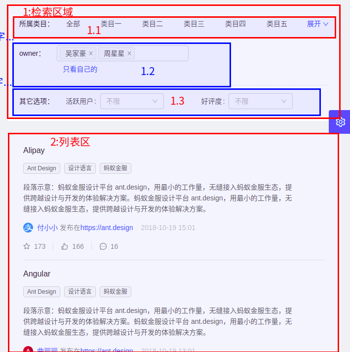

# ant design pro 例子说明

> 目录

* [表单页](#表单页)
  * [基础表单](#基础表单)
  * [分布表单](#分布表单)
  * [高级表单](#高级表单)
* [列表页](#列表页)
  * [查询列表](#查询列表)
  * [标准列表](#标准列表)
  * [卡片列表](#卡片列表)
  * [搜索列表](#搜索列表)
    * [文章页面](#文章页面)
    * [项目页面](#项目页面)
    * [应用页面](#应用页面)
* 详情页
  * 基础详情页
  * 高级详情页
* 结果页
  * 成功页
  * 失败页


## 表单页


### 基础表单

```
给出了基本的表单中控件的用法
```


### 分布表单

```
分布提交的用法
１：需要单独建立一个目录，并且第一个文件要用index
```


### 高级表单

```
1:多个编辑输入框，还包含一个table输入框
2:使用了一个table输入框，还要看看是怎么获取数据源的
```


## 列表页

在列表页的例子中，可以学习到如何从服务器得到数据. 在这个例子中有一个model文件，放在了models文件下


###查询列表

> 有如下功能可以参考一下

* 具体代码在TableList.js
* 点击配置，弹出了一个多步的对话框
* 如何从mock得到测试数据
* 一个js文件中，有多个类，这个例子还是很有意思的
* 在列表中有下面好玩的
  * 可以填充数据
  * 可以排序
  * 可以进行筛选
  * 有的行是禁止选择的


#### 疑问

```
1:为什么有的用{}，难道代表集合
    const FormItem = Form.Item;
    const { Step } = Steps;
    
２:@Form.create() 的作用，为什么有的页面中没有，难道是用到进行form数据交换的？

３:怎么才能把把这个问见中的三个类拆分成，三个文件

４：三个点是什么意思？　const formVals = { ...oldValue,...fieldsValue}，是拼接一个集合吗？

5：@connect的作用？
    @connect(({ rule, loading }) => ({
      rule,
      loading: loading.models.rule,
    }))


```


### 标准列表

#### 数据查询

将数据查询出来，共分５步

> 1:在pages调用modle的函数．下面是page文件，BasicList.js文件中，当页面显示的时候，调用了查询语句

```js
  componentDidMount() {
    const { dispatch } = this.props;
    dispatch({
      type: 'list/fetch',　//这行代码，调用了model中的list/fetch方法
      payload: {　　　　　　//这部分代码，是给链接传递参数　　　　
        count: 5,
      },
    });
  }
```

> ２:model调用service的函数．下面是model文件，list.js

```js
import { queryFakeList, removeFakeList, addFakeList, updateFakeList } from '@/services/api';

export default {
  namespace: 'list',

  state: {
    list: [],
  },

  effects: {
    *fetch({ payload }, { call, put }) {　//在page中，调用了fetch函数
      const response = yield call(queryFakeList, payload);　//queryFakeList 是service中定义的函数
      yield put({
        type: 'queryList',
        payload: Array.isArray(response) ? response : [],
      });
    },
```


> service中调用远程API，或者调用mock函数．下面是services/api.js中的函数

```js
//queryFakeList被model调用
export async function queryFakeList(params) {
  return request(`/api/fake_list?${stringify(params)}`);
}
/*
/api/fake_list 如果mock中配置的有，那么默认访问测试文件，当然也可以写成真实的地址
stringify 函数自动把参数给拼装了
export async function dva() {
  return request('http://wx.runzhichina.com/wechat/adImgs/imgList');
}
*/
```


> mock中显示具体的数据

```js
export default {
  'GET /api/project/notice': getNotice,
  'GET /api/activities': getActivities,
  'POST /api/forms': (req, res) => {
    res.send({ message: 'Ok' });
  },
  'GET /api/tags': mockjs.mock({
    'list|100': [{ name: '@city', 'value|1-100': 150, 'type|0-2': 1 }],
  }),
  'GET /api/fake_list': getFakeList, //在mock中调用了模拟查询的函数
  'POST /api/fake_list': postFakeList,
  'GET /api/captcha': getFakeCaptcha,
};
```


####页面分析	


这个页面显示部分，分为两个Card标签．

第一个标签是页面Title

##### 第1个Card:页面Title

```js
          <Card bordered={false}>
            <Row>
              <Col sm={8} xs={24}>
                <Info title="我的待办" value="8个任务" bordered />
              </Col>
              <Col sm={8} xs={24}>
                <Info title="本周任务平均处理时间" value="32分钟" bordered />
              </Col>
              <Col sm={8} xs={24}>
                <Info title="本周完成任务数" value="24个任务" />
              </Col>
            </Row>
          </Card>
```


##### 第2个Card:列表页

###### 区域２:列表标题

在Card的属性里面设置，后面有三个复杂的操作按钮，通过`extra` 来实现

```js
          <Card
            className={styles.listCard}
            bordered={false}
            title="标准列表"
            style={{ marginTop: 24 }}
            bodyStyle={{ padding: '0 32px 40px 32px' }}
            extra={extraContent}
          >
```


###### 区域３:添加按钮

```js
            <Button
              type="dashed"
              style={{ width: '100%', marginBottom: 8 }}
              icon="plus"
              onClick={this.showModal}
              ref={component => {
                /* eslint-disable */
                this.addBtn = findDOMNode(component);
                /* eslint-enable */
              }}
            >
              添加
            </Button>
```

###### 区域4:行头

```js
                  <List.Item.Meta
                    avatar={<Avatar src={item.logo} shape="square" size="large" />}
                    title={<a href={item.href}>{item.title}</a>}
                    description={item.subDescription}
                  />
```


###### 区域5:行具体内容

```js
<ListContent data={item} />
```


###### 区域６:行操作区

list中的actions就是操作的内容

```js
                <List.Item
                  actions={[
                    <a
                      onClick={e => {
                        e.preventDefault();
                        this.showEditModal(item);
                      }}
                    >
                      编辑
                    </a>,
                    <MoreBtn current={item} />,
                  ]}
                >
```


###### 区域7:分页区

在进行list配置的时候，自动显示分页，关于分页的页面操作，现在还要研究

paginationProps

```js
            <List
              size="large"
              rowKey="id"
              loading={loading}
              pagination={paginationProps}
              dataSource={list}
              renderItem={item => (
```


#### 页面函数


|   函数名   | 功能 | 备注 |
| ---- | ---- | ---- |
| state | 页面的变量 | visible：是否显示对话框<br>done：是否提交了确认按钮<br>可以动态追加变量，例如current，表示当前数据 |
| componentDidMount | 页面打开时，查询数据 | 这是一个默认函数，参数可以通过payload传递 |
| showModal | 显示增加对话框 | 设置了visible: true,current: **undefined**, |
| showEditModal | 显示编辑对话框 | 设置了visible: true,current: **item**, |
| handleDone | 结果对话框按钮事件 | done: false,visible: false, |
| handleCancel | 编辑或新增对话框事件 | visible: false, |
| handleSubmit | 编辑或新增对话框事件 | 首先要检验，然后就提交到服务器的接口 |
| deleteItem | 上出一行数据 | 调用服务器的接口 |
| | | |
| | | |

####页面常量


##### page类的常量

| 常量名           | 功能               | 备注                                                         |
| ---------------- | ------------------ | ------------------------------------------------------------ |
| state（类）      | 页面的变量         | visible：是否显示对话框<br>done：是否提交了确认按钮<br>可以动态追加变量，例如current，表示当前数据 |
| formLayout（类） | 样式               |                                                              |
| addBtn（类）     | 这个不知道是啥用途 | this.addBtn = findDOMNode(component);                        |


##### html代码的常量

主要是为了重用这些代码，将不同的html进行了封装，这样整体的代码看起来就少了很多

| 常量名          | 功能                           | 备注 |
| --------------- | ------------------------------ | ---- |
| paginationProps | 定义了分页组件                 |      |
| editAndDelete   | 定义了删除前提示对话框         |      |
| modalFooter     | 定义新增或编辑对话框的底部按钮 |      |
| Info            | 定义头部提示三个图示框的样式   |      |
| extraContent    | 定义列表前的检索按钮区域       |      |
| ListContent     | 定义列表的content区域          |      |
| MoreBtn         | 定义列表的［更多］下拉按钮     |      |
| getModalContent | 定义对话框的内容               |      |


#### Model接口

[这篇文章要好好读读](https://www.jianshu.com/p/f7401adce447)

effects会调用reducers，effects是异步的，reducers是同步的


##### effects

| 函数名            | 功能               | 备注                                                         |
| ----------------- | ------------------ | ------------------------------------------------------------ |
| /list/fetch       | 从数据库中查询数据 |                                                              |
| /list/appendFetch |                    |                                                              |
| /list/submit      | 提交数据           | 如果存在payload.id，如何payload的长度不等于1，那么就更新．否则认为id为空，就新追加函数 |


##### reducers

```js
    *fetch({ payload }, { call, put }) {
      const response = yield call(queryFakeList, payload);
      yield put({
        type: 'queryList',
        payload: Array.isArray(response) ? response : [],
      });
    },
```


> queryList 与appendList　被上面使用了

```js
  reducers: {
    queryList(state, action) {
      return {
        ...state,
        list: action.payload,
      };
    },
    appendList(state, action) {
      return {
        ...state,
        list: state.list.concat(action.payload),
      };
    },
  }
```


#### Service函数


| 函数名         | 功能                 | 备注 |
| -------------- | -------------------- | ---- |
| queryFakeList  | 根据参数查询一个列表 |      |
| removeFakeList | 删除一个             |      |
| addFakeList    | 添加一个             |      |
| updateFakeList | 更新                 |      |


```js
export async function queryFakeList(params) {
  return request(`/api/fake_list?${stringify(params)}`);
}

export async function removeFakeList(params) {
  const { count = 5, ...restParams } = params;
  return request(`/api/fake_list?count=${count}`, {
    method: 'POST',
    body: {
      ...restParams,
      method: 'delete',
    },
  });
}

export async function addFakeList(params) {
  const { count = 5, ...restParams } = params;
  return request(`/api/fake_list?count=${count}`, {
    method: 'POST',
    body: {
      ...restParams,
      method: 'post',
    },
  });
}

export async function updateFakeList(params) {
  const { count = 5, ...restParams } = params;
  return request(`/api/fake_list?count=${count}`, {
    method: 'POST',
    body: {
      ...restParams,
      method: 'update',
    },
  });
}
```


#### 服务器Controller的处理逻辑

服务器只有一个函数fake_list，通过这个函数，最后都放回一个list,并且删除，新追加，以及更新都在这个函数．

所以，这里有一个疑问，在服务器设计的时候，怎么处理？


### 卡片列表

这个页面很简单，没有复制的查询功能

##### 数据查询

这部分数据查询，同标准列表的数据查询．

##### 页面分析


###### 头部PageHeaderWrapper组件

* 区域１:使用了PageHeaderWrapper的**title**属性
* 区域2: 使用了PageHeaderWrapper的**content**属性
* 区域3:使用了PageHeaderWrapper的**extraContent**属性

```js
<PageHeaderWrapper title="卡片列表" content={content} extraContent={extraContent}>
```


######列表部分List组件

* 区域5使用了，Card组件

```js
<List 
  rowKey="id"
  grid={{ gutter: 24, lg: 3, md: 2, sm: 1, xs: 1 }}
  dataSource={['', ...list]}
  renderItem={item =>
    item ? (
      <List.Item key={item.id}>
          <Card hoverable className={styles.card} actions={[<a>操作一</a>, <a>操作二</a>]}>
            <Card.Meta
              avatar={}
              title={<a>{item.title}</a>}
              description={
                <Ellipsis className={styles.item} lines={3}>
                  {item.description}
                </Ellipsis>
              }
            />
          </Card>
      </List.Item>
      ):(
        <List.Item>
          <Button type="dashed" className={styles.newButton}>
            <Icon type="plus" /> 新增产品
          </Button>
        </List.Item>
      )}
/>
```


### 搜索列表

这里里面有三级菜单，如何显示不显示三级菜单,下面是注意事项：

* 除了添加三个页面js文件，还要添加两个文件：List.js与Applications.js
* 资源文件中，是继承父亲的名字的，所以要加上父节点的名字：

> 页面效果


> 　路由的配置

* 首先定义父级菜单：这个父菜单有一个component，这里是因为三个页面有公共的部分
* 设计默认跳转：第一个是默认redirect到文章页．
* 后面是三个默认的页面跳转：Articles Projects Applications

```js
{
  path: '/list/search_fan',
  name: 'searchlist_fan',
  component: './List/List_fan',
  routes: [
    {
      path: '/list/search_fan',
      redirect: '/list/search/articles_fan',
    },
    {
      path: '/list/search/articles_fan',
      name: 'articles_fan',
      component: './List/Articles_fan',
    },
    {
      path: '/list/search/projects_fan',
      name: 'projects_fan',
      component: './List/Projects_fan',
    },
    {
      path: '/list/search/applications_fan',
      name: 'applications_fan',
      component: './List/Applications_fan',
    },
  ],
},
```

* 父节点的component有时候是不需要的，见异常页的界面定义

```js
      {
        name: 'exception',
        icon: 'warning',
        path: '/exception',
        routes: [
          // exception
          {
            path: '/exception/403',
            name: 'not-permission',
            component: './Exception/403',
          },
          {
            path: '/exception/404',
            name: 'not-find',
            component: './Exception/404',
          },
          {
            path: '/exception/500',
            name: 'server-error',
            component: './Exception/500',
          },
          {
            path: '/exception/trigger',
            name: 'trigger',
            hideInMenu: true,
            component: './Exception/TriggerException',
          },
        ],
      },
```


> 资源文件的配置

```js
  'menu.list.searchlist_fan': '搜索列表1',
  'menu.list.searchlist_fan.articles_fan': '搜索列表（文章）1',
  'menu.list.searchlist_fan.projects_fan': '搜索列表（项目）1',
  'menu.list.searchlist_fan.applications_fan': '搜索列表（应用）1',
```


##### 公共component

这部分内容是公共的部分

> 页面部分的展示

这里使用了PageHeaderWrapper，并使用了其中的tabList的功能

```js
    return (
      <PageHeaderWrapper
        title="搜索列表"
        content={mainSearch}
        tabList={tabList}
        tabActiveKey={location.pathname.replace(`${match.path}/`, '')}
        onTabChange={this.handleTabChange}
      >
        {children}
      </PageHeaderWrapper>
    );
```

> 如果Tab变更了，就调用handleTabChange函数

通过key来判断是那个页面

```js
  handleTabChange = key => {
    const { match } = this.props;
    switch (key) {
      case 'articles':
        router.push(`${match.url}/articles_fan`);
        break;
      case 'applications':
        router.push(`${match.url}/applications_fan`);
        break;
      case 'projects':
        router.push(`${match.url}/projects_fan`);
        break;
      default:
        break;
    }
  }
```

> 检索部分的代码与时间处理

```js
	//html代码部分
	const mainSearch = (
      <div style={{ textAlign: 'center' }}>
        <Input.Search
          placeholder="请输入"
          enterButton="搜索"
          size="large"
          onSearch={this.handleFormSubmit}
          style={{ width: 522 }}
        />
      </div>
    );
	//函数部分
	handleFormSubmit = (value) => {
    	// eslint-disable-next-line
    	console.log(value);
  	}


```

> 注意事项

key一定要与url的结尾一致，因为通过这个名字，来判断那个tab是活跃的．

```js
    const tabList = [
      {
        key: 'articles_fan',
        tab: '文章',
      },
      {
        key: 'projects_fan',
        tab: '项目',
      },
      {
        key: 'applications_fan',
        tab: '应用',
      },
    ];

	//见PageHeaderWrapper的定义
	//tabActiveKey={location.pathname.replace(`${match.path}/`, '')}
    //这句话就是为了去掉前缀，得到一个key值
```

##### 文章页面

文章页面有几个特点，首先有一个就是，分页加载





###### 检索区域

主要使用了Form与FormItem组件，与Select组件

> 所属类目

使用了TagSelect组件

> owner

使用了Select组件，这是一个多选，并且有一个超链接定义了一个事件


###### 列表区域

> 使用了StandardFormRow标准的检索组件

一行是一个区域，每行有一个下划线

> 使用了Form.item组件

FormItem


###### 数据查询

> 使用了List Model的查询信息

```js
  componentDidMount() {
    const { dispatch } = this.props;
    dispatch({
      type: 'list/fetch',
      payload: {
        count: 5,
      },
    });
  }
```

###### 公共组件


| 组件名         | 内容                                                         |
| -------------- | ------------------------------------------------------------ |
| owners         | 一个josn字符串，为了owner下拉框设置                          |
| IconText       | 这个组件，可以传递两个参数，分别是icon与text                 |
| ListContent    | List的内容组件，可以传递５个参数，里面有一个格式化时间的函数 |
| formItemLayout | 用来做自适应的页面扩展                                       |
| loadMore       | 是否显示加载更多按钮，以及这个按钮的事件                     |


###### 相关函数


>  检索区域发生变化时，触发函数

> onValuesChange 当Form中数值发生变化时，触发这个事件

如果改变了查询内容，就重新加载数据

changedValues是当前改变的数据，allValues是当前页面的数据

```js
@Form.create({
  onValuesChange({ dispatch }, changedValues, allValues) {
    // 表单项变化时请求数据
    // eslint-disable-next-line
    // 模拟查询表单生效
    console.log("==========================================")
    dispatch({
      type: 'list/fetch',
      payload: {
        count: 5,
      },
    });
  },
})
```
> 　页面初始化

从数据库查询出数据来

```js
  componentDidMount() {
    const { dispatch } = this.props;
    dispatch({
      type: 'list/fetch',
      payload: {
        count: 5,
      },
    });
  }
```

> 加载更多按钮

React难道每次都把数据缓存到前端吗？

```js
  fetchMore = () => {
    const { dispatch } = this.props;
    dispatch({
      type: 'list/appendFetch',
      payload: {
        count: pageSize,
      },
    });
  };
```

 > 点击加载自己超链接

```js
  setOwner = () => {
    const { form } = this.props;
    form.setFieldsValue({
      owner: ['wzj'],
    });
  };

//render 中这么来设置，某个node中的事件

<FormItem>
  {getFieldDecorator('owner', {
    initialValue: ['wjh', 'zxx'],
  })(
    <Select
      mode="multiple"
      style={{ maxWidth: 286, width: '100%' }}
      placeholder="选择 owner"
    >
      {owners.map(owner => (
        <Option key={owner.id} value={owner.id}>
          {owner.name}
        </Option>
      ))}
    </Select>
  )}
  <a className={styles.selfTrigger} onClick={this.setOwner}>
    只看自己的
  </a>
</FormItem>


```


##### 项目页面


###### 组件的区别

这个页面使用了PureComponent，而文章页面使用了Component．

那么React.Component与React.PureComponent的区别是什么？

```
React.PureComponent 与 React.Component 几乎完全相同，但 React.PureComponent 通过prop和state的浅对比来实现 shouldComponentUpate()。

如果React组件的 render() 函数在给定相同的props和state下渲染为相同的结果，在某些场景下你可以使用 React.PureComponent 来提升性能。

React.PureComponent 的 shouldComponentUpdate() 只会对对象进行浅对比。如果对象包含复杂的数据结构，它可能会因深层的数据不一致而产生错误的否定判断(表现为对象深层的数据已改变视图却没有更新, 原文：false-negatives)。当你期望只拥有简单的props和state时，才去继承 PureComponent ，或者在你知道深层的数据结构已经发生改变时使用 forceUpate() 。或者，考虑使用 不可变对象 来促进嵌套数据的快速比较。

此外,React.PureComponent 的 shouldComponentUpate() 会忽略整个组件的子级。请确保所有的子级组件也是”Pure”的。
--------------------- 
原文：https://blog.csdn.net/qq_29854831/article/details/79657718 
```


页面的

AvatarList

使用了Card组件，制作了相关页面	

```js
        <Col lg={8} md={10} sm={10} xs={24}>
          <Card
            className={styles.card}
            hoverable
            cover={}
          >
            <Card.Meta
              title={<a>tile</a>}
              description={<Ellipsis lines={2}>城镇中有那么多的酒馆，她却偏偏走进了我的酒馆</Ellipsis>}
            />
          </Card>
        </Col>
```


##### 应用页面

