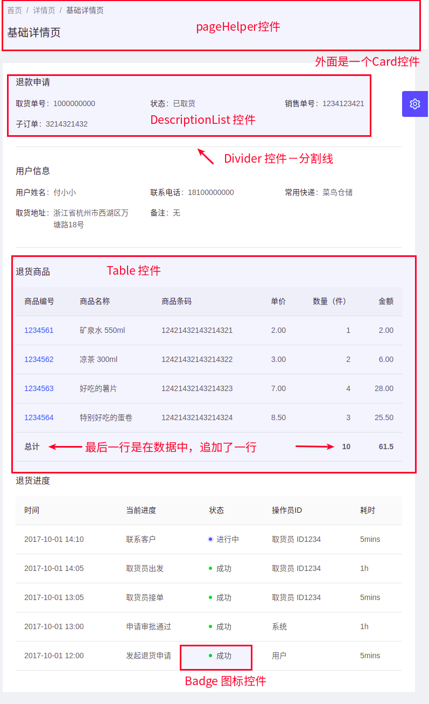
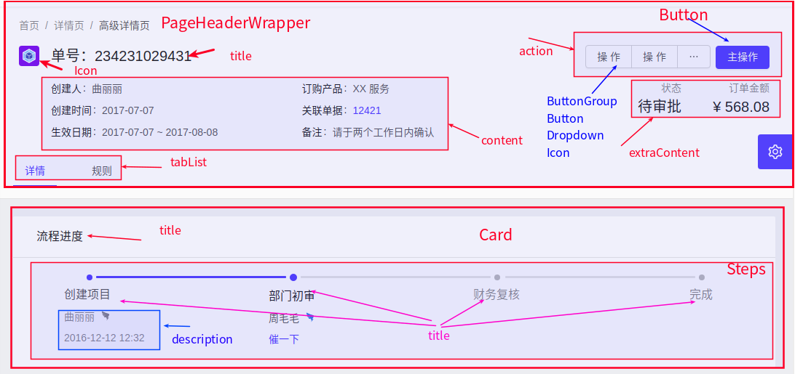
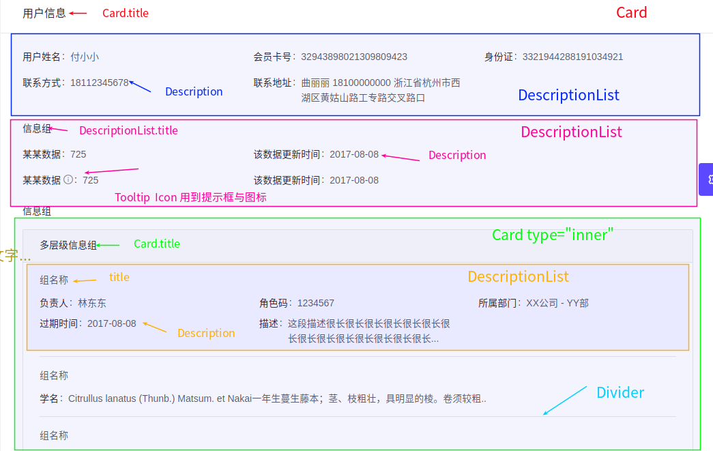

# ant design pro 例子-详情页

> 目录

* [基础详情](#基础详情)
  * [数据查询](#数据查询)
  * [如何代理到后端服务器](#如何代理到后端服务器)
  * [页面分析1](#页面分析1)
* [高级详情](#高级详情)
  * [页面分析2](#页面分析2)


## 基础详情

```
这个页面是一个退货的信息页面，包含下面的信息：
１：退货申请＋申请人（这部分的信息，是写死到页面上的）
２：退货的商品List
３：退货进度List

用到的控件有：
１：Card控件: 一个白色的框
２：Table控件：显示列表
３：Badge控件：徽标数  
４：Divider控件：一条分割线
５：PageHeaderWrapper控件：ant design pro 自带的控件，有导航条与tile　
６：DescriptionList控件：成组展示多个只读字段，常见于详情页的信息展示。

```

* [Table展示行列数据](https://ant.design/components/table-cn/)
* [Badge控件说明](https://ant.design/components/badge-cn/)
* [Divider分割线](https://ant.design/components/divider-cn/)

* [PageHeaderWrapper控件说明](https://pro.ant.design/components/PageHeader-cn/)

* [DescriptionList控件说明](https://pro.ant.design/components/DescriptionList-cn/)


### 数据查询

[官方前端请求的讲解](https://pro.ant.design/docs/server-cn)


```
models:
	pages/Profile/models/profile.js 文件
	调用了@/services/api中的queryBasicProfile与queryAdvancedProfile函数
	通过调用service，自己实现了两个方法
		fetchBasic与fetchAdvanced
	并且定义了若干状态
    	  state: {
            basicGoods: [],
            advancedOperation1: [],
            advancedOperation2: [],
            advancedOperation3: [],
          }
          
servies:
	services/api.js
	这里定义了两个方法
	export async function queryBasicProfile() {
      return request('/api/profile/basic');
    }
    export async function queryAdvancedProfile() {
      return request('/api/profile/advanced');
    }
    上面的request除了可以写一个地址，也可以写一个http的url
    
mock:
	在mock中写自己的链接
	profile.js中有：退货的商品列表与进度列表
    
    
	
```


### 如何代理到后端服务器

* [参考网址](https://pro.ant.design/docs/faq-cn#如何代理到后端服务器？)

Ant Design Pro 内置了 umi，umi 使用了 webpack [devServer](https://webpack.docschina.org/configuration/dev-server/)来支持代理。 你只需要在 config.js 中配置 proxy 属性。只要 proxy 和 mock  url 不同，是可以共存的。

```js
{
  ...
  proxy:{
    '/server/api/': {
      target: 'https://preview.pro.ant.design/',
      changeOrigin: true,
      pathRewrite: { '^/server': '' }, // /server/api/currentUser -> /api/currentUser
    },
  },
  ...
}
```

在浏览器中输入 <http://localhost:8000/server/api/currentUser> 预览。


### 页面分析1





5 5 10 4 2  19*2=38+5=43


## 高级详情页


```
用到的控件有
	1: PageHeaderWrapper控件：ant design pro 自带的控件，有导航条与tile　
	2: DescriptionList控件：成组展示多个只读字段，常见于详情页的信息展示。
	Crad Tab 进度条控件　　Table Badge


```


### 页面分析2

```
  １：Button 按钮
  ２：Menu　菜单－下拉按钮的菜单
  ３：Dropdown　下来按钮
  ４：Icon　图标
  ５：Row　　行列用到
  ６：Col　列用到的
  ７：Steps　进度条
  ８：Card　区块
  ９：Popover　气泡卡片
  １０：Badge　徽标数
  １１：Table　表格
  １２：Tooltip文字提示
  １３：Divider　分割线
```

* [Popover气泡卡片](https://ant.design/components/popover-cn/)
* [Tooltip文字提示](https://ant.design/components/tooltip-cn/#API)








