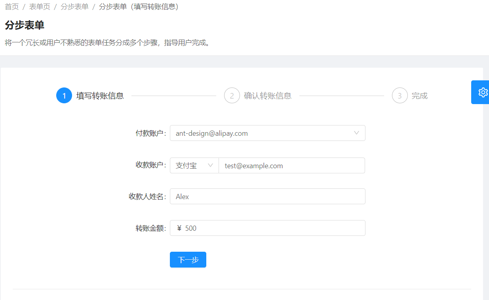
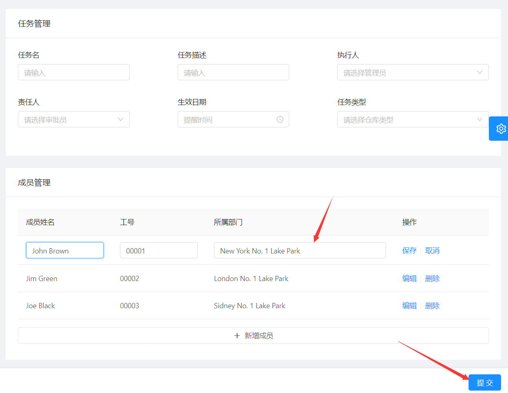

# ant design pro --表单

> 目录


* [基础表单](#基础表单)
* [分布表单](#分布表单)
* [高级表单](#高级表单)


## 基础表单

```
给出了基本的表单中控件的用法
```


## 分布表单





* 1：这里面有4个文件
  * 首先是外围的模板文件，这个配置是通过`router.config.js`来配置的
  * 其次使用了三个单独的文件，嵌套到外围模板文件总。
* 2：这三个表单，都通过一个统一的state来传递数据。


> 配置的模板`router.config.js`

```jsx
{
  path: '/form/step-form',
  name: 'stepform',
  component: './Forms/StepForm',
  hideChildrenInMenu: true,
  routes: [
    {
      path: '/form/step-form',
      redirect: '/form/step-form/info',
    },
    {
      path: '/form/step-form/info',
      name: 'info',
      component: './Forms/StepForm/Step1',
    },
    {
      path: '/form/step-form/confirm',
      name: 'confirm',
      component: './Forms/StepForm/Step2',
    },
    {
      path: '/form/step-form/result',
      name: 'result',
      component: './Forms/StepForm/Step3',
    },
  ],
},
```


## 高级表单




这个表格有两个可以参考的：

* 1：有一个固定的提交按钮。
  * 使用了Pro中的`FooterToolbar`这个控件。

* 2：可以在一个List控件中添加数据。
  * 自定义了一个`TableForm`控件，这个控件还比较复杂，不适合多内容编辑