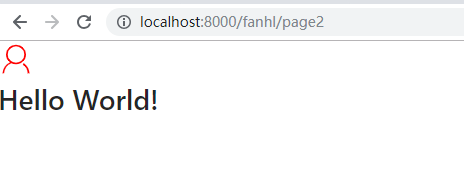

# 快速入门


[TOC]


## 知识点

| 功能                                                         | 说明                         | 参考文档                          |
| ------------------------------------------------------------ | ---------------------------- | --------------------------------- |
| Dva                                                          | 负责数据交互                 | [官方网址](https://dvajs.com/)    |
| Umi                                                          | 负责路由                     | [官方文档](https://umijs.org/zh/) |
| [MDN文档](https://developer.mozilla.org/zh-CN/docs/Web/CSS/Reference) | CSS基本文档                  |                                   |
| [less](http://lesscss.cn/)                                   | Less 是一门 CSS 预处理语言。 |                                   |
|                                                              |                              |                                   |


## 路由和菜单

[官方文档-路由和菜单](https://ant-design-pro.gitee.io/docs/router-and-nav-cn)


### 菜单


| 功能                   | 实现方法                                         | 未完成 |
| ---------------------- | ------------------------------------------------ | ------ |
| 添加一级菜单及子菜单   | 子菜单的前缀必须与菜单的一致。为了实现菜单的缩进 |        |
| 跳转到外部地址         | 看下面的例子                                     |        |
| 在菜单中使用自定义图标 | 看官方的例子                                     |        |
| 打开一个新页面         | 看下面的例子                                     |        |
| 隐藏菜单               | hideInMenu hideChildrenInMenu                    |        |
| 菜单带参数             |                                                  | 不知道 |
| 菜单权限               | authority: ['admin', 'user']                     |        |
| 从服务器动态得到菜单   |                                                  |        |
| 多语言处理             |                                                  |        |


```
{
    path: 'https://pro.ant.design/docs/getting-started-cn',
    target: '_blank', // 点击新窗口打开
    name: "文档",
}
```


### 路由

| 功能         | 实现方法    | 未完成 |
| ------------ | ----------- | ------ |
| 全局错误路由 | 404错误路由 |        |
|              |             |        |
|              |             |        |


### 面包屑


## 布局

[官方文档-布局](https://ant-design-pro.gitee.io/docs/layout-cn)


| 功能                               | 实现方法 | 未完成 |
| ---------------------------------- | -------- | ------ |
| UserLayout布局                     |          |        |
| BasicLayout布局                    |          |        |
| 如何自己做一个布局                 |          |        |
| 网上有没有现成的布局               |          |        |
| 如何使用Ant Design的Layout布局组件 |          |        |


在 Ant Design Pro 中，我们抽离了使用过程中的通用布局，都放在 `layouts` 目录中，分别为：

- BasicLayout：基础页面布局，包含了头部导航，侧边栏和通知栏：
- UserLayout：抽离出用于登陆注册页面的通用布局
- BlankLayout：空白的布局


## 新增页面

* [官方文档](https://ant-design-pro.gitee.io/docs/new-page-cn)

  一、新增 js、less 文件
  二、将文件加入菜单和路由
  三、新增 model、service

  布局及路由都配置好之后，回到之前新建的 `NewPage.js`，可以开始写业务代码了！如果需要用到 [dva](https://github.com/dvajs/dva/) 中的数据流，还需要在 `src/models` `src/services` 中建立相应的 model 和 service，具体可以参考脚手架内置页面的写法。	


### 简单页面

这个页面只包含一个简单的html代码

```jsx
import React from 'react'; //这句话也可以不要
export default () => (
  <div>
    <h1>Hello Word</h1>
  </div>
);
```


### 基于Class组件页面

```jsx
import React, { PureComponent } from 'react';

class Page2 extends PureComponent {
  render() {
    return (
      <h1>Hello World!</h1>
    );
  }
}

export default Page2;
```

> 上面可以在浏览器中正确显示，但是在IDE中提示错误，可能的原因是因为没有把相关事件给写入


* React.Component与React.PureComponent的区别
```
 React.PureComponent 与 React.Component 几乎完全相同，但 React.PureComponent 通过prop和state的浅对比来实现 shouldComponentUpate()。

如果React组件的 render() 函数在给定相同的props和state下渲染为相同的结果，在某些场景下你可以使用 React.PureComponent 来提升性能。
```


## 新增业务组件

>  [官方文档](https://ant-design-pro.gitee.io/docs/new-component-cn)


对于一些可能被多处引用的功能模块，建议提炼成业务组件统一管理。这些组件一般有以下特征：

- 只负责一块相对独立，稳定的功能；
- 没有单独的路由配置；
- 可能是纯静态的，也可能包含自己的 state，**但不涉及 dva 的数据流，仅受父组件（通常是一个页面）传递的参数控制。**


组件定义是未来项目中常见的内容，要充分掌握。官方文档的例子很容易掌握

| 功能                           | 实现方法       | 未完成 |
| ------------------------------ | -------------- | ------ |
| 如何自定义一个组件             | 参考文档       |        |
| 如何使用别人的组件             |                |        |
| 组件比较复杂，如何分为多个文件 | 官方文档有例子 |        |


## 样式

> [官方文件](https://ant-design-pro.gitee.io/docs/style-cn)


| 功能                 | 实现方法                                                   | 未完成 |
| -------------------- | ---------------------------------------------------------- | ------ |
| 熟悉CSS与LESS        |                                                            |        |
| CSS模块化            | 通过import styles from './***.less'; 来做前缀              |        |
| 定义全局CSS          | 使用 :global                                               |        |
| src/global.less      | 可以定义一些全局的CSS                                      |        |
| src/utils/utils.less | 这里可以放置一些工具函数供调用，比如清除浮动 `.clearfix`。 |        |
| 其他CSS级别          | 模块样式 通用模块级 页面级 组件级 页面级别                 |        |
| 覆盖组件样式         | 例如可以覆盖antd的组件样式，参考官方文档                   |        |


```
/* 定义全局样式 */
:global(.text) {
  font-size: 16px;
}

/* 定义多个全局样式 */
:global {
  .footer {
    color: #ccc;
  }
  .sider {
    background: #ebebeb;
  }
}
```


上面只对 CSS Modules 进行了最基础的介绍，有兴趣可以参考其他文档：

- [github/css-modules](https://github.com/css-modules/css-modules)
- [CSS Modules 用法教程](http://www.ruanyifeng.com/blog/2016/06/css_modules.html)
- [CSS Modules 详解及 React 中实践](https://github.com/camsong/blog/issues/5)


## 和服务端进行交互


### 前端请求流程

1. UI 组件交互操作；

2. 调用 model 的 effect；

3. 调用统一管理的 service 请求函数；放在 `services` 文件夹中

4. 使用封装的 request.js 发送请求；`utils/request.js` 是基于 [fetch](https://developer.mozilla.org/en-US/docs/Web/API/Fetch_API/Using_Fetch) 的封装

5. 获取服务端返回；

6. 然后调用 reducer 改变 state；

7. 更新 model。

   

>  例如在 services 中的一个请求用户信息的例子：

```js
// services/user.js
import request from '../utils/request';

export async function query() {
  return request('/api/users');
}

export async function queryCurrent() {
  return request('/api/currentUser');
}

// models/user.js
import { queryCurrent } from '../services/user';
...
effects: {
  *fetch({ payload }, { call, put }) {
    ...
    const response = yield call(queryUsers);
    ...
  },
}
```


### 处理异步请求

在处理复杂的异步请求的时候，很容易让逻辑混乱，陷入嵌套陷阱，所以 Ant Design Pro 的底层基础框架 [dva](https://github.com/dvajs/dva) 使用 `effect` 的方式来管理同步化异步请求：

```js
effects: {
  *fetch({ payload }, { call, put }) {
    yield put({
      type: 'changeLoading',
      payload: true,
    });
    // 异步请求 1
    const response = yield call(queryFakeList, payload);
    yield put({
      type: 'save',
      payload: response,
    });
    // 异步请求 2
    const response2 = yield call(queryFakeList2, payload);
    yield put({
      type: 'save2',
      payload: response2,
    });
    yield put({
      type: 'changeLoading',
      payload: false,
    });
  },
},
```

通过 [generator](https://developer.mozilla.org/es/docs/Web/JavaScript/Reference/Statements/function*) 和 [yield](https://developer.mozilla.org/es/docs/Web/JavaScript/Reference/Operators/yield) 使得异步调用的逻辑处理跟同步一样，更多可参看 [dva async logic](https://github.com/dvajs/dva/blob/master/docs/GettingStarted.md#async-logic)。


## 引入外部模块

除了 antd 组件以及脚手架内置的业务组件，有时我们还需要引入其他外部模块，这里以引入富文本组件 [react-quill](https://www.npmjs.com/package/react-quill) 为例进行介绍。


### 引入依赖

在终端输入下面的命令完成安装：

```bash
$ npm install react-quill --save
```

> 加上 `--save` 参数会自动添加依赖到 package.json 中去。


### 使用

直接贴代码了：

```jsx
import React from 'react';
import { Button, notification, Card } from 'antd';
import ReactQuill from 'react-quill'; 
import 'react-quill/dist/quill.snow.css';

export default class NewPage extends React.Component {
  state = {
    value: 'test',
  };

  handleChange = (value) => {
    this.setState({
      value,
    })
  };

  prompt = () => {
    notification.open({
      message: 'We got value:',
      description: <span dangerouslySetInnerHTML={{ __html: this.state.value }}></span>,
    });
  };

  render() {
    return (
      <Card title="富文本编辑器">
        <ReactQuill value={this.state.value} onChange={this.handleChange} />
        <Button style={{ marginTop: 16 }} onClick={this.prompt}>Prompt</Button>
      </Card>
    );
  }
}
```


## 构建和发布

* [官方文档](https://ant-design-pro.gitee.io/docs/deploy-cn)


### 构建

当项目开发完毕，只需要运行一行命令就可以打包你的应用：

```bash
$ npm run build
```


### 分析构建文件体积

如果你的构建文件很大，你可以通过 analyze 命令构建并分析依赖模块的体积分布，从而优化你的代码。
```bash
$ npm run analyze
```
上面的命令会自动在浏览器打开显示体积分布数据的网页。


### 发布

对于发布来讲，只需要将最终生成的静态文件，也就是通常情况下 dist 文件夹的静态文件发布到你的 cdn 或者静态服务器即可，需要注意的是其中的 index.html 通常会是你后台服务的入口页面，在确定了 js 和 css 的静态之后可能需要改变页面的引入路径。

### 使用 nginx

nginx 作为最流行的 web 容器之一，配置和使用相当简单，只要简单的配置就能拥有高性能和高可用。推荐使用 nginx 托管。示例配置如下：

```json
worker_processes  1;

events {
    worker_connections  1024;
}


http {

    include       mime.types;
    default_type  application/octet-stream;
	sendfile        on;
    keepalive_timeout  65;

    server {
        listen       80;
		server_name  127.0.0.1 localhost;
		gzip on;
		gzip_min_length 1k;
		gzip_comp_level 9;
		gzip_types text/plain application/javascript application/x-javascript text/css application/xml text/javascript application/x-httpd-php image/jpeg image/gif image/png;
		gzip_vary on;
		gzip_disable "MSIE [1-6]\.";

		root E:/00-code/WebstormProjects/antpro-project/dist;
		
		location / {
			try_files $uri $uri/ /index.html;
		}
	 
	    location /api {
			proxy_pass https://preview.pro.ant.design;
			proxy_set_header   X-Forwarded-Proto $scheme;
			proxy_set_header   Host              $http_host;
			proxy_set_header   X-Real-IP         $remote_addr;
		}
	 
    }

}
```

> 注意事项

* gzip_comp_level 9; 要求;号进行结尾
* 样式显示不全，是因为
  * include       mime.types; default_type  application/octet-stream;  这两行没有添加


## 使用 TypeScript

> 下一阶段使用

## 图表

可以使用阿里的，也可以使用baidu的，百度的听说做的挺好的，还兼容微信小程序。

## 业务图标


### 使用系统自带的图标

Ant Design 提供的 `<Icon />` 图标组件来使用 [Ant Design 官方图标](http://ant.design/components/icon-cn/)。基本使用方式如下：

```jsx
import { Icon } from 'antd';

................................

<Icon type="heart" style={{ fontSize: '16px', color: 'hotpink' }} />
```


### 使用 SVG Symbol 

SVG 符号引入是现代浏览器未来主流的图标引入方式。其方法是预先加载符号，在合适的地方引入并渲染为矢量图形。有如下特点：

- 支持多色图标，不再受到单色图标的限制
- 通过一些技巧，支持像字体那样，通过 `font-size`、`color` 来调整样式
- 支持IE 9+ 及现代浏览器


> 在www.iconfont.cn，建立一个项目，然后生成一个url


> 建立一个组件

```js
import { Icon } from 'antd';
const IconFont = Icon.createFromIconfontCN({
  scriptUrl: '//at.alicdn.com/t/font_742790_jsptxl4ze8b.js'
});
export default IconFont;
```

> 在具体页面中使用

```jsx
import React, {Component } from 'react';

import IconFont from '@/components/Fanhl/IconFont';
class Page2 extends Component {
  render() {
    return (
      <div>
        <IconFont type="icon-wode" style={{ fontSize: '36px', color: 'red' }} />
        <h1>Hello World!</h1>
      </div>

    );
  }
}
export default Page2;
```

> 页面中可以看到



## Mock 和联调

* [官方说明](https://ant-design-pro.gitee.io/docs/mock-api-cn)


Mock 数据是前端开发过程中必不可少的一环，是分离前后端开发的关键链路。通过预先跟服务器端约定好的接口，模拟请求数据甚至逻辑，能够让前端开发独立自主，不会被服务端的开发所阻塞。[mock官方网站](https://github.com/nuysoft/Mock/wiki/Mock.mock())


| 目标                           | 实现方法                                                     | 未完成               |
| ------------------------------ | ------------------------------------------------------------ | -------------------- |
| 如何使用外部的Json文件         | 使用importy引入json文件                                      |                      |
| 获得request的参数              | 见例子                                                       |                      |
| 如何使用Mock自带的函数模拟数据 | 可以随机生成模拟数据                                         |                      |
| 添加跨域请求头                 |                                                              | 还不知道这个有什么用 |
| 模拟延迟                       | 大部分函数不用模拟超时                                       |                      |
| 生成 API 文档                  | [roadhog-api-doc](https://github.com/nikogu/roadhog-api-doc) | 需要研究研究         |

### 建立Mock文件

umi 里约定 mock 文件夹下的文件即 mock 文件，文件导出接口定义，支持基于 `require` 动态分析的实时刷新，支持 ES6 语法，以及友好的出错提示，详情参看 [umijs.org](https://umijs.org/guide/mock-data.html)。

```js
export default {
  // 支持值为 Object 和 Array
  'GET /api/users': { users: [1, 2] },

  // GET POST 可省略
  '/api/users/1': { id: 1 },

  // 支持自定义函数，API 参考 express@4
  'POST /api/users/create': (req, res) => { res.end('OK'); },
};
```


### 使用插件模拟延迟[#](https://ant-design-pro.gitee.io/docs/mock-api-cn#%E4%BD%BF%E7%94%A8%E6%8F%92%E4%BB%B6%E6%A8%A1%E6%8B%9F%E5%BB%B6%E8%BF%9F)

上面的方法虽然简便，但是当你需要添加所有的请求延迟的时候，可能就麻烦了，不过可以通过第三方插件来简化这个问题，如：[roadhog-api-doc#delay](https://github.com/nikogu/roadhog-api-doc/blob/master/lib/utils.js#L5)。

> 安装插件

```
npm install -save roadhog-api-doc
```

下面是一个具体的例子

```jsx
import Mock from 'mockjs';
import { delay } from 'roadhog-api-doc';
// 引用了外部一个Json文件
import roles from './fanhlData/roles';
const user = [
  '付小小',
  '曲丽丽',
  '林东东',
  '周星星',
  '吴加好',
  '朱偏右',
];
const getNotice = [
  {
    id: 'xxx1',
    user: user[0],
    description: '那是一种内在的东西，他们到达不了，也无法触及的',
    updatedAt: new Date(),
    member: '科学搬砖组',
    href: '',
    memberLink: '',
  },
  {
    id: 'xxx2',
    user: user[0],
    description: '希望是一个好东西，也许是最好的，好东西是不会消亡的',
    updatedAt: new Date('2017-07-24'),
    member: '全组都是吴彦祖',
    href: '',
    memberLink: '',
  },
  ];

function getRoles(req, res) {
  return res.json(roles);
};

function getRolesById(req, res) {
  console.log(req.query.roleId);
  return res.json(roles[req.query.roleId]);
};

function getMockList(req, res){
  const aaa=Mock.mock({
    'list|10': [{ name: '@city', 'value|1-100': 50, 'type|0-2': 1 }],
  })
  console.log(aaa);
  return res.json(aaa.list);
};

const proxy = {
  // 返回一个数组
  'GET /api/fanhl/user': user,
  // 返回一个json对象
  'GET /api/fanhl/getNotice': getNotice,
  // 支持自定义函数，API 参考 express@4
  'GET /api/fanhl/create': (req, res) => { res.end('OK'); },
  // 返回一个外部json文件
  'GET /api/fanhl/getRoles': getRoles,
  // 通过request参数从数组中获得数据
  // http://localhost:8000/api/fanhl/getRolesById?roleId=1
  'GET /api/fanhl/getRolesById': getRolesById,
  // 在一个函数中调用了Mock
  'GET /api/fanhl/getMockList': getMockList,
  // 静态的 只随机一次
  'GET /api/fanhl/random1': Mock.mock({'number|1-100': 100}),
  // 动态的 每次请求均产生随机值
  'GET /api/fanhl/random2': (req, res) =>{res.send(
                            Mock.mock({'number|1-100': 100})
                          )},
};

// 调用 delay 函数，统一处理
export default delay(proxy, 0);
```


