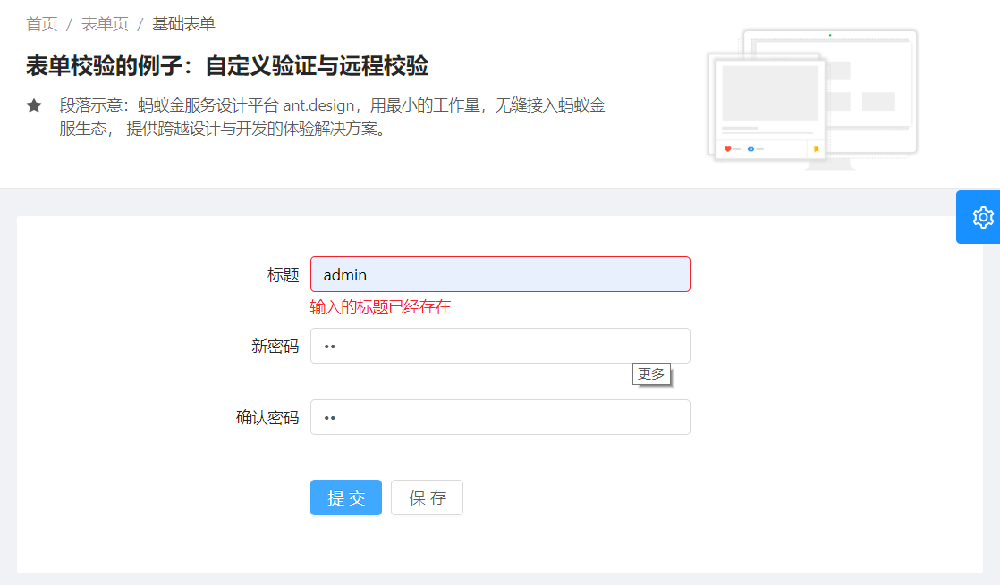

# Form 表单相关


## 校验




​	

### 自定义校验

判断两个输入框是否一致，所以自己定义了一个handleConfirmPassword函数

```jsx

<FormItem {...formItemLayout} label="新密码">
  {
    getFieldDecorator('newPassword', {
      rules: [{
        required: true,
        message: '请输入新密码',
      }],
    })(<Input type="password" />)
  }
</FormItem>
<FormItem {...formItemLayout} label="确认密码">
  {
    getFieldDecorator('confirmPassword', {
      rules: [{
        required: true,
        message: '请再次输入以确认新密码',
      }, {
        validator: this.handleConfirmPassword
      }],
    })(<Input type="password" />)
  }
</FormItem>

handleConfirmPassword = (rule, value, callback) => {
  console.log("handleConfirmPassword:",value)
  const { form:{getFieldValue} } = this.props
  if (value && value !== getFieldValue('newPassword')) {
    callback('两次输入不一致！')
  }
  // Note: 必须总是返回一个 callback，否则 validateFieldsAndScroll 无法响应
  callback()
}
```


### 进行服务器端校验

* [官方参考例子](https://github.com/react-component/form/blob/3b9959b57ab30b41d8890ff30c79a7e7c383cad3/examples/server-validate.js#L74-L79)


> 一个完整的例子


* mock 模拟一个函数checkTitle
  * 等待5秒，如果title==admin，就返回false,否则返回true
* service做一个这样的函数
* model中定义一个函数
* page中，调用这个函数
  * 同时添加一个加载的功能


#### mock 开发

在mock目录中fanhl.js中添加，这个函数等待5秒钟后执行

```js
// 这个例子用来测试异步校验
function checkTitle(req, res) {
  setTimeout( ()=>{
      console.log(req.query.title);
      const ren={}
      if(req.query.title==='admin'){
        ren.status=500;
        ren.message='输入的标题已经存在'
      }else{
        ren.status=200;
        ren.message='ok'
      }
      return res.json(ren);
    },5000
  )
}

..............

'GET /api/fanhl/checkTitle': checkTitle,
```


#### service 开发

```jsx
export async function checkTitle(payload) {
  const url =`/api/fanhl/checkTitle?${stringify(payload)}`
  return request(url);
}
```


#### model 开发

```jsx
import { checkTitle } from '@/services/new';

export default {
  namespace: 'formModel',
  state: {},

  effects: {
    *checkTitle({ payload }, { call }) {
      return yield call(checkTitle, payload);
    },
  },

  reducers: {

  },
};
```


#### page开发


> 提交函数

* 在dispath 函数中的then来表示执行成功的内容，并根据执行成功过的内容来判断是否有错误。
* 如果中间有date类型输入框，那么需要进行特殊处理
  * `const newDate=values.newDate.format(dateFormat);`

```jsx
handleSubmit = e => {
  const { dispatch, form } = this.props;
  e.preventDefault();
  form.validateFieldsAndScroll((err, values)
    if (!err) {
      console.log('values:',values)

      dispatch({
        type: 'formModel/checkTitle',
        payload: values,
      }).then((res) => {
        if(res.status===500){
          form.setFields({
            title: {
              value:values.title,
              errors: [new Error(res.message
            },
          });
        }else{
          dispatch({
            type: 'form/submitRegularForm',
            payload: values,
          });
        }
      }).catch((error) => {
        console.log("error===========:",erro
      })
    }
  });
};
```


> 提交表单

* 定义一个loading，当执行checkTitle命令时。
* 在button中的loading中将这两个数值传入

```jsx
@connect(({ loading }) => ({
  submitting: loading.effects['form/submitRegularForm'],
  checking: loading.effects['formModel/checkTitle'],
}))
@Form.create()
class BasicForms extends PureComponent {

................................................

<Form onSubmit={this.handleSubmit} hideRequiredMark colon={false} style={{ marginT
  <FormItem {...formItemLayout} label={<FormattedMessage id="form.title.label" />}
    {getFieldDecorator('title', {
      rules: [
        {
          required: true,
          message: formatMessage({ id: 'validation.title.required' }),
        },
      ],
    })(<Input placeholder={formatMessage({ id: 'form.title.placeholder' })} />)}
   </FormItem>
                                                                          
  <FormItem {...submitFormLayout} style={{ marginTop: 32 }}>
    <Button type="primary" htmlType="submit" loading={submitting||checking}>
      <FormattedMessage id="form.submit" />
    </Button>
    <Button style={{ marginLeft: 8 }}>
      <FormattedMessage id="form.save" />
    </Button>
  </FormItem>
                                                                          
</Form>                                                                          
                                                                          
```


### Promise 

ES6的Promise

* [Promise说明](https://www.liaoxuefeng.com/wiki/1022910821149312/1023024413276544)

* [[ES6 Promise 用法讲解](https://www.cnblogs.com/whybxy/p/7645578.html)]

