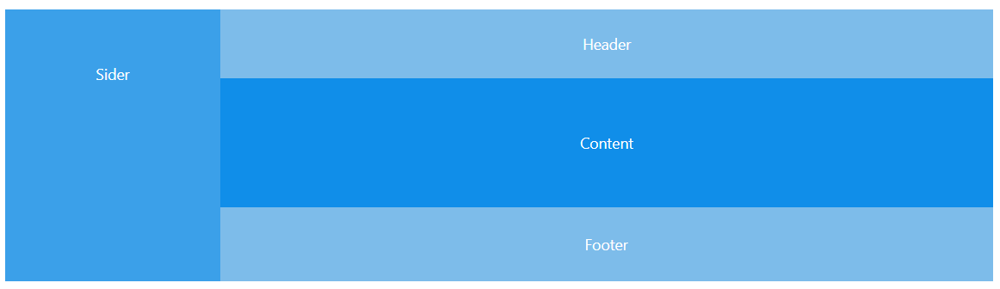

#  布局


[TOC]


## Layout布局


* 组件概述
  * `Layout`：布局容器，其下可嵌套 `Header` `Sider` `Content` `Footer` 或 `Layout` 本身，可以放在任何父容器中。
  * `Header`：顶部布局，自带默认样式，其下可嵌套任何元素，只能放在 `Layout` 中。
  * `Sider`：侧边栏，自带默认样式及基本功能，其下可嵌套任何元素，只能放在 `Layout` 中。
  * `Content`：内容部分，自带默认样式，其下可嵌套任何元素，只能放在 `Layout` 中。
  * `Footer`：底部布局，自带默认样式，其下可嵌套任何元素，只能放在 `Layout` 中。




```jsx
    <Layout>
      <Sider>Sider</Sider>
      <Layout>
        <Header>Header</Header>
        <Content>Content</Content>
        <Footer>Footer</Footer>
      </Layout>
    </Layout>
```


## BasicLayout 总体布局


### 布局


#### SilderMenu 左侧菜单

* 返回 `const { Sider } = Layout;`  [官方文档说明](https://ant-design.gitee.io/components/layout-cn/#Layout.Sider)


在菜单项目中使用了延迟加载功能：

```jsx
import React, { PureComponent, Suspense } from 'react';
const BaseMenu = React.lazy(() => import('./BaseMenu'));
.................
<Sider>
  <div className={styles.logo} id="logo">
    <Link to="/">
      
      <h1>{title}</h1>
    </Link>
  </div>
  <Suspense fallback={<PageLoading />}>
    <BaseMenu
      {...this.props}
      mode="inline"
      handleOpenChange={this.handleOpenChange}
      onOpenChange={this.handleOpenChange}
      style={{ padding: '16px 0', width: '100%' }}
      {...defaultProps}
    />
  </Suspense>
</Sider>
```


[Suspense说明](http://www.ptbird.cn/react-lazy-suspense-error-boundaries.html#menu_index_4)

##### BaseMenu 实际解析Menu的组件


#### Header

* `import Header from './Header';`调用了自己定义的组件Header

```jsx
<Header
  menuData={menuData}
  handleMenuCollapse={this.handleMenuCollapse}
  logo={logo}
  isMobile={isMobile}
  {...this.props}
/>
```


##### 组件定义

判断如果是菜单在顶部，并且不是移动端，那么就使用`TopNavHeader`，否则使用`GlobalHeader`

* `import GlobalHeader from '@/components/GlobalHeader';`
* `import TopNavHeader from '@/components/TopNavHeader';`

> GlobalHeader是最常用的一种模式


##### GlobalHeader

这个菜单分为两部分，左侧是`Icon` ，右侧是自己定义的组件`RightContent`


###### RightContent 头部菜单右部组件


| 编号 | 组件                    | 说明                                                         |
| ---- | ----------------------- | ------------------------------------------------------------ |
| 1    | HeaderSearch-搜索       | [HeaderSearch顶部搜索框](http://pro.ant.design/components/header-search-cn) |
| 2    | Tooltip -帮助           | antDesign的标准组件                                          |
| 3    | NoticeIcon-提示框       | [NoticeIcon通知菜单](http://pro.ant.design/components/notice-icon-cn) |
| 4    | HeaderDropdown-用户信息 | ../HeaderDropdown 自定义的一个组件                           |
| 5    | SelectLang-语言选择     | ../SelectLang 自定义的一个组件                               |


#### Content 内容

	* `const { Content } = Layout;`

```jsx
<Content className={styles.content} style={contentStyle}>
  {children}
</Content>
```


#### Footer 页脚

* 使用了：`layouts/Footer.js`
* 在`Footer.js`中使用了`@/components/GlobalFooter`组件
  * [GlobalFooter全局页脚使用说明](http://pro.ant.design/components/global-footer-cn)


### 数据


| model           | 数据                        | 说明 |
| --------------- | --------------------------- | ---- |
| global          | global.collapsed            |      |
| setting         | setting.layout              |      |
| menu: menuModel | menuModel.menuData          |      |
| menu: menuModel | menuModel.breadcrumbNameMap |      |
| ...setting      | ...setting                  |      |


#### global 

> state

```jsx
namespace: 'global',
state: {
  collapsed: false,
  notices: [],
},

```


> 异步函数 effects

| 函数名                | 功能说明                                                     | 备注                                      |
| --------------------- | ------------------------------------------------------------ | ----------------------------------------- |
| fetchNotices          | 得到通知列表，并保存到state，并且得到了notice的数量，保存到user Model的changeNotifyCount中。 | 这里使用了select，用来获得当前state的内容 |
| clearNotices          | 清空通知列表，并且会调用user Model的changeNotifyCount中。    |                                           |
| changeNoticeReadState | 改变通知的读取状态，调用了saveNotices与user/changeNotifyCount |                                           |


> 同步函数 reducers

| 函数名                | 功能说明            | 备注 |
| --------------------- | ------------------- | ---- |
| saveNotices           |                     |      |
| saveClearedNotices    |                     |      |
| changeLayoutCollapsed | 改变collapsed的状态 |      |

> 注册函数 subscriptions

```jsx
subscriptions: {
  setup({ history }) {
    // Subscribe history(url) change, trigger `load` action if pathname is `/`
    return history.listen(({ pathname, search }) => {
      if (typeof window.ga !== 'undefined') {
        window.ga('send', 'pageview', pathname + search);
      }
    });
  },
},

```


#### setting

> state 


state 引用了一个外部文件defaultSettings

```jsx
import defaultSettings from '../defaultSettings';
state: defaultSettings,
```

这里使用了几个全局变量

```jsx
module.exports = {
  navTheme: 'dark', // theme for nav menu
  primaryColor: '#1890FF', // primary color of ant design
  layout: 'sidemenu', // nav menu position: sidemenu or topmenu
  contentWidth: 'Fluid', // layout of content: Fluid or Fixed, only works when layout is topmenu
  fixedHeader: false, // sticky header
  autoHideHeader: false, // auto hide header
  fixSiderbar: false, // sticky siderbar
  menu: {
    disableLocal: false,
  },
  title: 'Ant Design Pro',
  pwa: true,
  // Your custom iconfont Symbol script Url
  // eg：//at.alicdn.com/t/font_1039637_btcrd5co4w.js
  // 注意：如果需要图标多色，Iconfont 图标项目里要进行批量去色处理
  // Usage: https://github.com/ant-design/ant-design-pro/pull/3517
  iconfontUrl: '',
};
```


> 同步函数 reducers

* getSetting
* changeSetting


#### menu

> state

```jsx
state: {
  menuData: [],
  routerData: [],
  breadcrumbNameMap: {},
},

```

> effects 异步函数

* getMenuData


