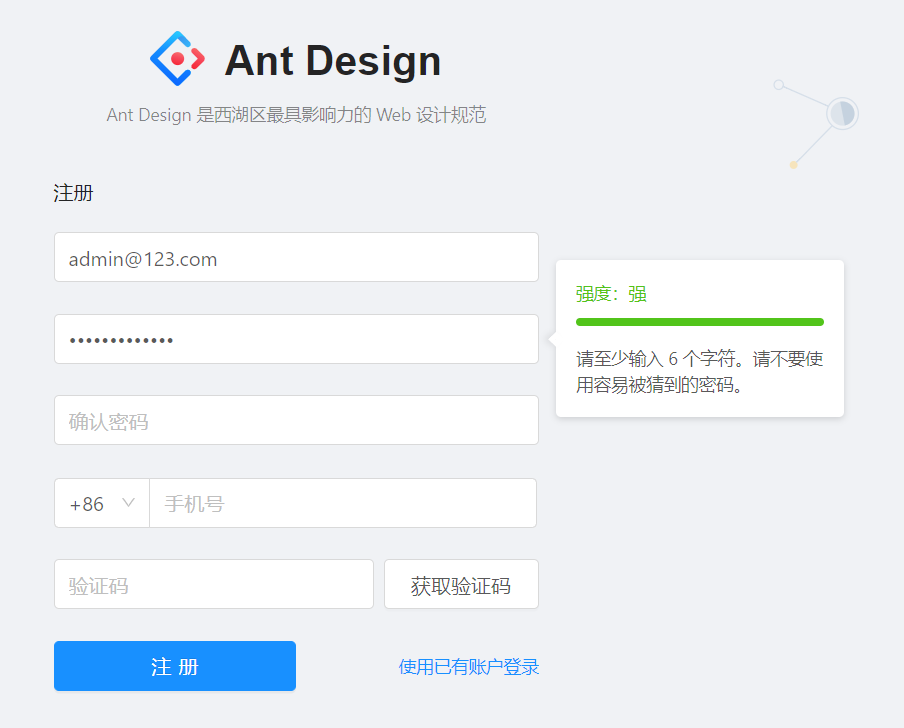

# 登陆逻辑


[登陆组件](http://pro.ant.design/components/login-cn)


## Service模块

使用了多个模块

```jsx
import { fakeAccountLogin, getFakeCaptcha } from '@/services/api';
import { setAuthority } from '@/utils/authority';
import { getPageQuery } from '@/utils/utils';
import { reloadAuthorized } from '@/utils/Authorized';
```


* `fakeAccountLogin`  : 登陆函数，返回当前登陆状态
* `getFakeCaptcha` :得到验证码
* `setAuthority` :设置当前角色
* `getPageQuery`：得到一个URL中`?`后面的内容
* `reloadAuthorized`：刷新框架的角色信息


>setAuthority：将角色添加到localStorage

```jsx
export function setAuthority(authority) {
  const proAuthority = typeof authority === 'string' ? [authority] : authority;
  return localStorage.setItem('antd-pro-authority', JSON.stringify(proAuthority));
}
```


## Model模块


文件：src/models/login.js


> state

```jsx
state: {
  status: undefined,
},
```


> effects


* **login登陆**
  * 从API得到登陆结果。并将结果更新到state
    * 在更新state之前要`setAuthority()`，去设置当前的状态
  * 如果返回的结果成功
    * 刷新当前的`Authory`: `reloadAuthorized()`
    * 如果有redirect，那么跳转到对应的URL，否则跳转到`/`
* **getCaptcha得到手机验证码**
* **logout**
  * 将登陆的state中status设置成false。
  * 如果URL不等于`/user/login`，也不等于`redirect`
    * 挑转到login，并设置redirect


> reducers

* **changeLoginStatus**

改变登陆状态

```jsx
setAuthority(payload.currentAuthority);
return {
  ...state,
  status: payload.status,
  type: payload.type,
};
```


## UI模块


###  登陆login

在登陆模块，可以通过用户名与密码进行登陆，也可以通过手机来进行登陆。


>  目录下有一个login1.js，实现的远程登陆。如果密码输入正确，服务器返回的内容是：

```json
{
	roles: [{roleId: 1, rolename: "ROLE_ADMIN", description: "管理员", sort: 0}], 
	token: "Bearer eyJhbGciOiJIUzUxMiJ9.eyJjcmVhdGVkIjoxNTU2MT…WoKdQaPYbUC5AdcCBgmsNZgIMGaKpOOJ4qmfKbb37Yho31DTg"
}
```


### 登出 logout

* 在`BasicLayout`中的`Header`,菜单中，有logout功能，调用了`login/logout`
* `user`的model，将status设置成false，并将Authority设置成`guset`，当推出后，将当前页面赋值到regist


### 自动登陆 AutoLogin

还没有实现。一般使用cookie来实现。


### 关于获得注册码功能

Promise  then catch

```jsx
  onGetCaptcha = () =>
    new Promise((resolve, reject) => {
      this.loginForm.validateFields(['mobile'], {}, (err, values) => {
        if (err) {
          reject(err);
        } else {
          const { dispatch } = this.props;
          dispatch({
            type: 'login/getCaptcha',
            payload: values.mobile,
          })
            .then(resolve)
            .catch(reject);
          message.warning(formatMessage({ id: 'app.login.verification-code-warning' }));
        }
      });
    });
```


# 注册逻辑





## Service模块

> mock 模拟数据


```jsx
'POST /api/register': (req, res) => {
  res.send({ status: 'ok', currentAuthority: 'user' });
},
```


> service 

```jsx
export async function fakeRegister(params) {
  return request('/api/register', {
    method: 'POST',
    data: params,
  });
}
```


## Model模块

当登陆成功后，就设置`Authority`并重新`reloadAuthorized()`

```jsx
state: {
  status: undefined,
},
effects: {
  *submit({ payload }, { call, put }) {
    const response = yield call(fakeRegister, payload);
    yield put({
      type: 'registerHandle',
      payload: response,
    });
  },
},
reducers: {
  registerHandle(state, { payload }) {
    setAuthority('user');
    reloadAuthorized();
    return {
      ...state,
      status: payload.status,
    };
  },
},
```


## UI模块


### 提交模块

prefix是电话好码的前缀

```jsx
handleSubmit = e => {
  e.preventDefault();
  const { form, dispatch } = this.props;
  form.validateFields({ force: true }, (err, values) => {
    if (!err) {
      const { prefix } = this.state;
      dispatch({
        type: 'register/submit',
        payload: {
          ...values,
          prefix,
        },
      });
    }
  });
};
```


### 提交后跳转页

`componentDidUpdate` 在组件完成更新后立即调用。在初始化时不会被调用。

如果发现是ok，就跳转到成功页面。 当然这个也可以在model中来实现。

另外在整个注册过程中，没有考虑到以下情况：

* email已经存在。
* 出现错误时，应该怎么提示。

```jsx
componentDidUpdate() {
  const { form, register } = this.props;
  const account = form.getFieldValue('mail');
  if (register.status === 'ok') {
    router.push({
      pathname: '/user/register-result',
      state: {
        account,
      },
    });
  }
}

```


### 密码校验

有两个属性`help`与`visible`，分别用来提示错误与控制提示car的显示。

`callback`正常返回与错误返回可以学习`callback('error')`


``` jsx
checkPassword = (rule, value, callback) => {
  const { visible, confirmDirty } = this.state;
  if (!value) {
    this.setState({
      help: formatMessage({ id: 'validation.password.required' }),
      visible: !!value,
    });
    callback('error');
  } else {
    this.setState({
      help: '',
    });
    if (!visible) {
      this.setState({
        visible: !!value,
      });
    }
    if (value.length < 6) {
      callback('error');
    } else {
      const { form } = this.props;
      if (value && confirmDirty) {
        form.validateFields(['confirm'], { force: true });
      }
      callback();
    }
  }
};
```


# 其他技巧


不让chrome自动将用户名与密码填写进去：

**autoComplete="new-password"**

```jsx
<Password autoComplete="new-password" />
<Input autoComplete="new-password" />
```

