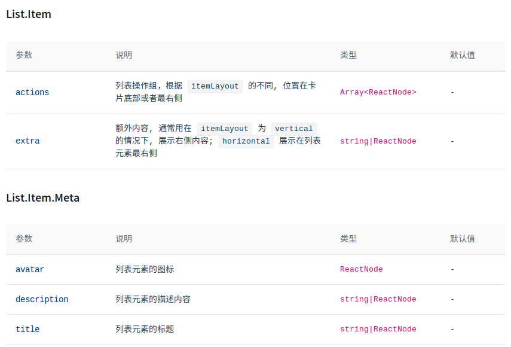

# 常见问题


> 目录

* [跨域问题](#跨域问题)
* [JSON处理](#json处理)
* [栅格使用](#栅格使用)
* [List列表使用](#list列表使用)
* [Avatar头像](#avatar头像)
* [Modal对话框](#modal对话框)
* [Form组件](#form组件)
* [AvatarList组件](#AvatarList组件)
* [Card组件](#Card组件)
* 缓存
* mock与真实环境切换


[参考文档](https://www.jianshu.com/p/1329a324101d)


## 跨域问题

解决方案是在springboot中添加允许跨域访问的方法

> 测试需要的地址

```
例如访问路径：
http://wx.runzhichina.com//wechat/adImgs/imgList
http://wx.runzhichina.com//wechat/adImgs/add
http://wx.runzhichina.com//wechat/adImgs/update
http://wx.runzhichina.com//wechat/adImgs/delete?adImgId=13
http://wx.runzhichina.com//wechat/adImgs/selectById?adImgId=13
http://wx.runzhichina.com//wechat/adImgs/getListByPage?pageNum=1&pageSize=3
{
    "adImgId": 1,
    "fileName": "001.jpg",
    "imgColor": "868f8a",
    "imgType": null,
    "description": "了解腹部肌肉的构成，这能使你的训练效果达到最佳",
    "status": 0,
    "gmtCreate": 1533989992000,
    "gmtModified": 1533989992000
}
// 上面的数据中，fileName和adImgId不能重复


在蚂蚁中访问
http://localhost:8000/list/dva
```

> springboot中的代码

```java
package com.wukong.donghai.config;

import org.springframework.context.annotation.Configuration;
import org.springframework.web.servlet.config.annotation.CorsRegistry;
import org.springframework.web.servlet.config.annotation.EnableWebMvc;
import org.springframework.web.servlet.config.annotation.WebMvcConfigurer;

/**
 * 添加跨域请求
 * 参考了　https://blog.csdn.net/b376924098/article/details/79709075
 * @author fanhl
 */
@Configuration
@EnableWebMvc
public class CorsConfig implements WebMvcConfigurer {
    @Override
    public void addCorsMappings(CorsRegistry registry) {
        //设置允许跨域的路径
        registry.addMapping("/**")
                //设置允许跨域请求的域名
                .allowedOrigins("*")
                //是否允许证书 不再默认开启
                .allowCredentials(true)
                //设置允许的方法
                .allowedMethods("*")
                //跨域允许时间
                .maxAge(3600);
    }
}
```


## JSON处理

> [参考文档](https://blog.csdn.net/qq_32014215/article/details/68063852)

```js
//在react中可以直接使用json
var   newData=JSON.stringify(list)
console.log(newData)
return(
    <div>dddd:{newData}</div>
)
```


## 栅格使用

> [官方参考文档](https://ant.design/components/grid-cn/)

```js
          <Card bordered={false}>
            <Col sm={12} xs={24}>
              <Info title="我的待办" value="8个任务" bordered />
            </Col>
            <Col sm={12} xs={24}>
              <Info title="本周任务平均处理时间" value="32分钟" bordered />
            </Col>
            <Col sm={12} xs={24}>
              <Info title="本周完成任务数" value="24个任务" />
            </Col>
          </Card>
```

预设六个响应尺寸：`xs` `sm` `md` `lg` `xl`  `xxl`


## List列表使用


> [官网介绍](https://ant-design.gitee.io/components/list-cn/)





## Avatar头像

> [官方介绍](https://ant.design/components/avatar-cn/)

可以把下面的代码复制到页面中

```js
<Avatar icon="user" />
<Avatar>U</Avatar>
<Avatar>USER</Avatar>
<Avatar src="https://zos.alipayobjects.com/rmsportal/ODTLcjxAfvqbxHnVXCYX.png" />
<Avatar style={{ color: '#f56a00', backgroundColor: '#fde3cf' }}>U</Avatar>
<Avatar style={{ backgroundColor: '#87d068' }} icon="user" />
    
<Badge count={1}><Avatar shape="square" icon="user" /></Badge>
<Badge dot><Avatar shape="square" icon="user" /></Badge>
```


## Modal对话框

> [官方介绍](https://ant-design.gitee.io/components/modal-cn/)


对话框有两种用法：

> 简单用法，例如一些删除前的确认

```js
const confirm = Modal.confirm;

function showConfirm() {
  confirm({
    title: 'Do you Want to delete these items?',
    content: 'Some descriptions',
    onOk() {
      console.log('OK');
    },
    onCancel() {
      console.log('Cancel');
    },
  });
}

//一些特殊提示框的做法

function warning() {
  Modal.warning({
    title: 'This is a warning message',
    content: 'some messages...some messages...',
  });
}
```

> 直接在一个对话框上编辑的

```js

        <Modal
          title={done ? null : `任务${current ? '编辑' : '添加'}`}
          className={styles.standardListForm}
          width={640}
          bodyStyle={done ? { padding: '72px 0' } : { padding: '28px 0 0' }}
          destroyOnClose
          visible={visible}
          {...modalFooter}
        >
          {getModalContent()} //这里面显示编辑框的内容
        </Modal>
```


## Form组件

form的功能还是很多的，在做编辑框的时候，可以仔细学习一下

[官方说明](https://ant.design/components/form-cn/)

* 有Form与Formitem两个组件
* 有不同的排列方法，横排与竖排列
* 可以进行校验，以及自定义校验
* **可以动态的增加表单项目（这个有意思）**
* 多个空间自动关联
* 自定义控件
* 提供了多个组件，例如文件上传等等


## TagSelect组件

这个组件是ant design pro 自己定义的组件


## Select 组件

[官方文档](https://ant.design/components/select-cn/)

* 可以disable整体或个别下拉框
* 带搜索功能的
* 多选框的
* 三种大小
* 具有过滤属性的
* 联动的
* 分组的**(这个非常好用，例如选择一个树形结构)**
* 除了得到value还可以得到text
* 输入内容，自动联想到远程数据
* 自动分词的效果


## AvatarList组件

这个是ant design pro 自己的组件


## Card组件

[官方介绍](https://ant.design/components/card-cn/)


这个要仔细看看

